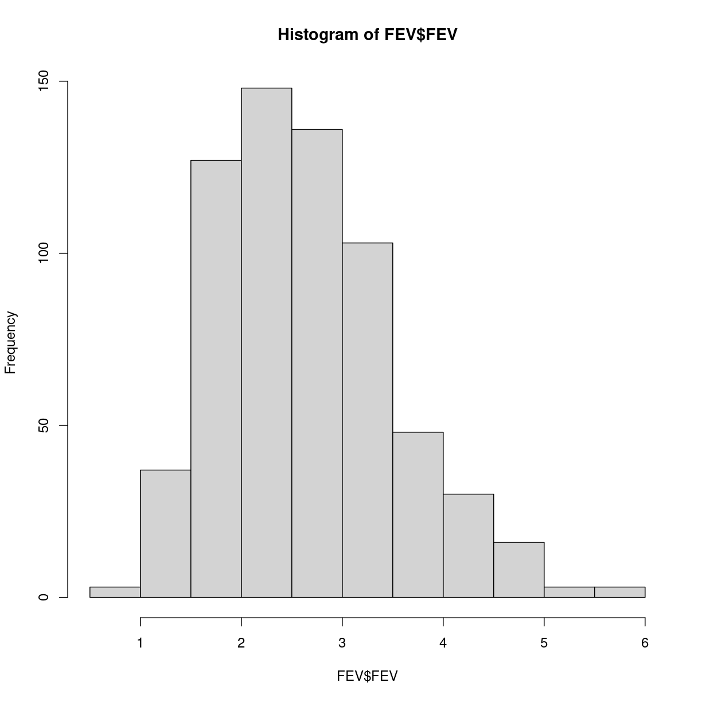
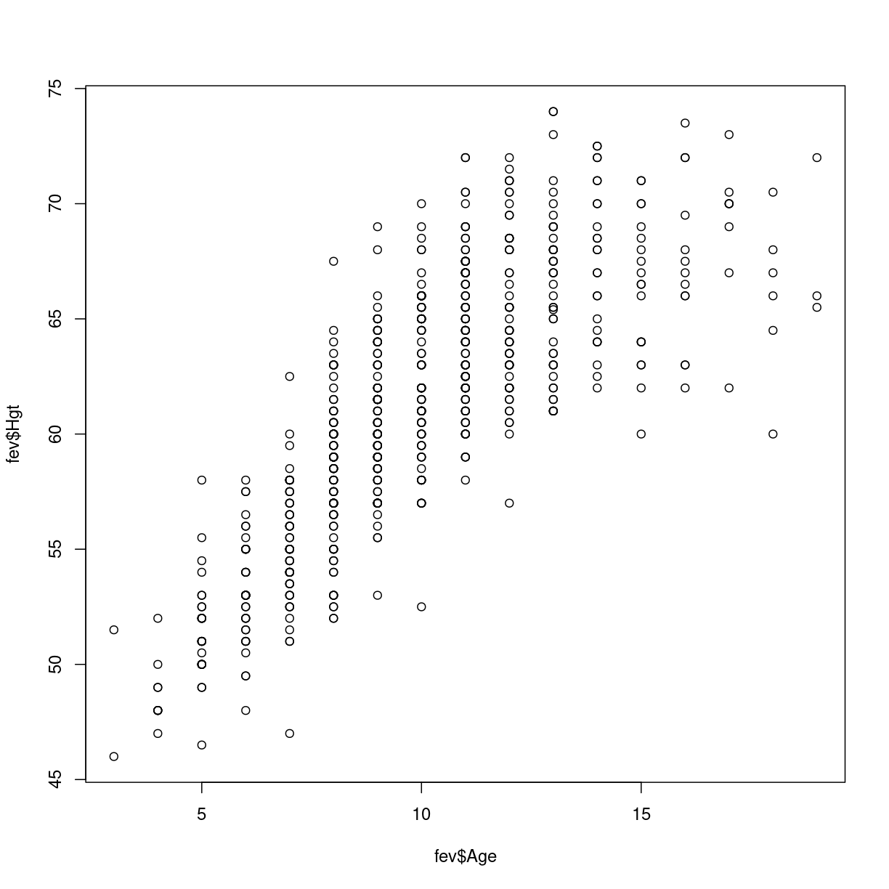
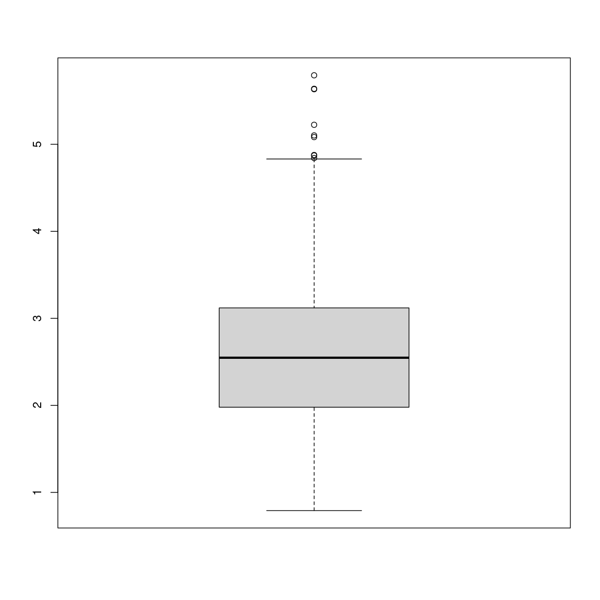
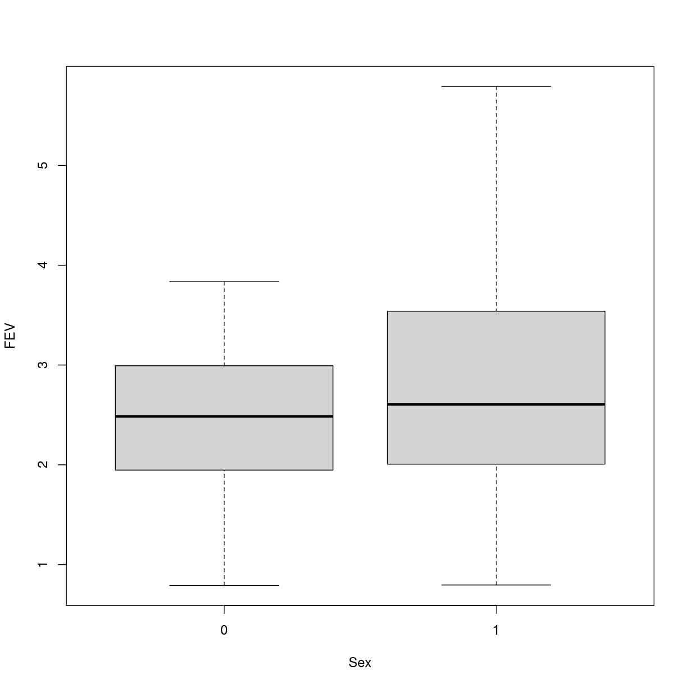

---
# Please do not edit this file directly; it is auto generated.
# Instead, please edit 02-deskriptiv-statistik.md in _episodes_rmd/
title: "Deskriptiv statistik og statistiske deskriptorer"
teaching: 10
exercises: 5
questions:
- "FIXME"
objectives:
- "FIXME"
keypoints:
- "FIXME"
source: Rmd
---

## Beskrivende statistik

Lad os starte med at få fingre i noget data.

Vi downloader et datasæt til vores `data` mappe:

~~~
download.file("https://raw.githubusercontent.com/KUBDatalab/R-PUFF-1-deskriptiv/main/data/FEV.csv", "data/fev.csv", mode = "wb")
~~~
{: .language-r}
Herefter kan vi indlæse filen til et objekt i R:

~~~
FEV <- read_csv("data/FEV.csv")
~~~
{: .language-r}

~~~
Rows: 654 Columns: 6
── Column specification ────────────────────────────────────────────────────────
Delimiter: ","
dbl (6): Id, Age, FEV, Hgt, Sex, Smoke

ℹ Use `spec()` to retrieve the full column specification for this data.
ℹ Specify the column types or set `show_col_types = FALSE` to quiet this message.
~~~
{: .output}

Datasættet indeholder oplysninger om lungevolumen (Forced expiratory volume), og
er kodet således:

|Variable |     Description     |      Format or Code
|---------|---------------------|----------------------------
| Id      |    ID number        |
| Age     |    Age (yrs)        |
| FEV     |    FEV (liters)     |      X.XXXX
| Hgt     |    Height (inches)  |      XX.X
| Sex     |    Sex              |      0=female/1=male
| Smoke   |    Smoking Status   |      0=non-current smoker/1=current smoker

Datasættet kan bruges til at vise sammenhænge mellem rygning, og lungekapacitet
for børn.

De første 10 rækker ser således ud:

~~~
head(FEV)
~~~
{: .language-r}

~~~
# A tibble: 6 × 6
     Id   Age   FEV   Hgt   Sex Smoke
  <dbl> <dbl> <dbl> <dbl> <dbl> <dbl>
1   301     9  1.71  57       0     0
2   451     8  1.72  67.5     0     0
3   501     7  1.72  54.5     0     0
4   642     9  1.56  53       1     0
5   901     9  1.90  57       1     0
6  1701     8  2.34  61       0     0
~~~
{: .output}

## Summary statistik

Summary statistik er statistiske mål der beskriver en fordeling. De opsummerer
mange tal, til et enkelt (eller nogle få) tal, deraf navnet.

I de følgende eksempler har vi brug for at kunne trække en enkelt variabel
ud af vores datasæt. Det kunne være FEV. 

Der er som regel altid mere end en måde at gøre ting på i programmering. 
Men en relativt let måde at trække værdierne for FEV ud af dette datasæt er at
bruge $-notationen:

~~~
FEV$FEV
~~~
{: .language-r}

~~~
[1] 1.708 1.724 1.720 1.558 1.895 2.336
~~~
{: .output}

Her trækker vi de første seks observationer ud - der er 654 ialt. Resultatet 
kaldes en `vektor`.

### Middelværdi

Middelværdien findes ved at give funktionen `mean()` en vektor med tallene:

~~~
mean(FEV$FEV)
~~~
{: .language-r}

~~~
[1] 2.63678
~~~
{: .output}
### Medianen

Medianen, den midterste værdi findes på lignende måde:

~~~
median(FEV$FEV)
~~~
{: .language-r}

~~~
[1] 2.5475
~~~
{: .output}
### Standardafvigelser

Nu kan vi genkende mønsteret. Vi skal finde funktionen der kan tage nogen tal
i form af en vektor, og beregne standardafvigelsen. Funktionen hedder `sd`:

~~~
sd(FEV$FEV)
~~~
{: .language-r}

~~~
[1] 0.8670591
~~~
{: .output}

### Varians

Og nu er det ingen overraskelse:

~~~
var(FEV$FEV)
~~~
{: .language-r}

~~~
[1] 0.7517915
~~~
{: .output}
Hvordan finder man den funktion man skal bruge? Først finder man ud af hvad 
det man vil gøre hedder på engelsk. Så søger man efter det i hjælpefunktionen
i RStudio. 

Eller også hiver man fat i ChatGPT eller Google.

## Frekvenser

Hvor mange drenge er der med i vores datasæt? Hvor mange piger?

Når vi tæller den slags, er det typisk fordi vi har med 
kategoriske variable at gøre, variable hvor der observationerne kun kan være 
i én af flere kategorier. Her køn, hvor de undersøgte børn er af enten hunkøn eller
hankøn.

En del statistiske tests fungerer kun hvis værdierne er kodet som kategoriske
værdier. Her er kønnet angivet som "0" eller "1", men det kunne lige så godt
forstås som talværdier, der også kunne være 0.123 eller 0.946. 

For at sikre at vores kategoriske data opfattes som kategoriske af R, kan vi
pakke dem ind i funktionen `factor` der i dette tilfælde konverterer hvad der ellers kunne forstås som tal, til en kategoriskværdi:

~~~
factor(FEV$Sex)
~~~
{: .language-r}

Det er ikke strengt nødvendigt i dette tilfælde, men det er et godt trick at 
kende.

Men hvordan tæller vi så? Vi bruger `table()` funktionen:

~~~
table(FEV$Sex)
~~~
{: .language-r}

~~~

  0   1 
318 336 
~~~
{: .output}
Ofte er vi også interesserede i at vide hvordan fordelingen er i procent. 

Det kan funktionen `prop.table()` hjælpe os med. Men først skal vi have
gemt antallet i et objekt:

> ## Øvelse
>
> Gem resultatet af `table(FEV$Sex)` i et objekt. Kald det `antal` og
> kør derefter funktione `prop.table()` på `antal`
>
> > ## Løsning
> > antal <- table(FEV$Sex)
> > 
> > prop.table(antal)
> {: .solution}
{: .challenge}

## Histogrammer

Histogrammer viser fordelingen af observationer grafisk.R har en indbygget 
funktion, `hist()` der gør netop det:

~~~
hist(FEV$FEV)
~~~
{: .language-r}

plot of chunk unnamed-chunk-14

### Hvad hvis vi vil vide hvordan de ser ud for rygende børn?

Hvis vi vil lave et histogram for FEV for de børn der ryger, skal vi først
have pillet de rygende børn ud af datasættet. 

Vi ved, eller kan slå op, at de børn der ryger, er markeret med et 1-tal i 
kolonnen `Smoke`:

~~~
FEV$Smoke
~~~
{: .language-r}

~~~
[1] 0 0 0 0 0 0
~~~
{: .output}
Her ser vi kun de første seks observationer - de er alle 0.

De tal kan vi sammenligne. Vi kan spørge: "Er værdien 0?". Hvis den er det,
så er der tale om et ikke-ryger barn. 

Den sammenligning kan vi lave på denne måde:

~~~
FEV$Smoke == 0
~~~
{: .language-r}

~~~
[1] TRUE TRUE TRUE TRUE TRUE TRUE
~~~
{: .output}
Vi ser igen kun på de første seks resultater. Svaret er "TRUE", altså at 
værdien i "Smoke" kolonen  er 0. Havde den ikke været det, havde svaret været
"FALSE".

Resultatet af vores sammenligning er en "logisk vektor". Og den kan vi bruge til
at "subsette" vores datasæt, så vi kun får de rækker, der matcher en "TRUE" 
værdi. Funktionen `subset()` er vores ven:

~~~
subset(FEV, Smoke == 0)
~~~
{: .language-r}

~~~
# A tibble: 589 × 6
      Id   Age   FEV   Hgt   Sex Smoke
   <dbl> <dbl> <dbl> <dbl> <dbl> <dbl>
 1   301     9  1.71  57       0     0
 2   451     8  1.72  67.5     0     0
 3   501     7  1.72  54.5     0     0
 4   642     9  1.56  53       1     0
 5   901     9  1.90  57       1     0
 6  1701     8  2.34  61       0     0
 7  1752     6  1.92  58       0     0
 8  1753     6  1.42  56       0     0
 9  1901     8  1.99  58.5     0     0
10  1951     9  1.94  60       0     0
# ℹ 579 more rows
~~~
{: .output}

> ## Øvelse
> Subset FEV datasættet, så du får de observationer i datasættet, der beskriver
> børn der ryger. Gem resultatet i et nyt objekt, og plot histogrammet
>
> Bonus øvelse, lav samme øvelse, med de børn der _ikke_ ryger.
> 
> > ## Løsning
> > rygere <- subset(FEV, Smoke == 1)
> > 
> > hist(rygere)
> >
> > Bonus:
> > 
> > ikkerygere <- subset(FEV, Smoke == 0)
> > 
> > hist(ikkerygere)
> > 
> {: .solution}
{: .challenge}

## Referenceinterval
Det interval indenfor hvilket 95% af observationerne ligger. Eller - ved hvilken
værdi er 2.5% af observationerne lavere, og ved hvilken værdi er 2.5% af 
observationerne højere. Det fører til at 100% - 2.5% - 2.5% = 95% af observationerne
ligger mellem de to værdier. Funktionen `quantile()` kan hjælpe:

~~~
quantile(FEV$FEV, 0.025)
~~~
{: .language-r}

~~~
    2.5% 
1.339625 
~~~
{: .output}

~~~
quantile(FEV$FEV, 0.975)
~~~
{: .language-r}

~~~
 97.5% 
4.6227 
~~~
{: .output}
Det kan vi samle i en enkelt linie kode_

~~~
quantile(FEV$FEV, c(0.025, 0.975))
~~~
{: .language-r}

~~~
    2.5%    97.5% 
1.339625 4.622700 
~~~
{: .output}

## Scatterplot

Vi så histogramemt - hvor vi tæller hvor mange observationer af en bestemt 
variabel vi har i forskellige intervaller. Når vi vil plotte to værdier mod hinanden i et scatterplot, så skal vi angive hvad vi vil have på x-aksen og hvad der skal
være på y-aksen. Og derfor skal den indbyggede `plot()` funktion have to
vektorer med tal:

~~~
plot(FEV$Age, FEV$Hgt)
~~~
{: .language-r}

plot of chunk unnamed-chunk-23

# Boxplot

Boxplots samler en række opsummerende statistiske værdier for en variabel i 
ét plot. Vi kan angive det på lidt forskellige måder, men foretrækker denne:

~~~
boxplot(FEV$FEV, data= FEV)
~~~
{: .language-r}

plot of chunk unnamed-chunk-24

Og hvorfor det? Fordi det gør det lettere at forstå, at når vi vil have 
to boxplots, et for drenge og et for piger, så kan vi let få det på denne måde:

~~~
boxplot(FEV~Sex, data = FEV)
~~~
{: .language-r}

plot of chunk unnamed-chunk-25

Som det fremgår, er de fleste af de statiske funktioner vi skal bruge ret 
enkle. Hvis ellers man kan finde ud af hvilken af dem man skal bruge. Og hvis
man kan få manipuleret sine data, så de har den rigtige form og indhold. Og det 
er ikke helt så enkelt.


