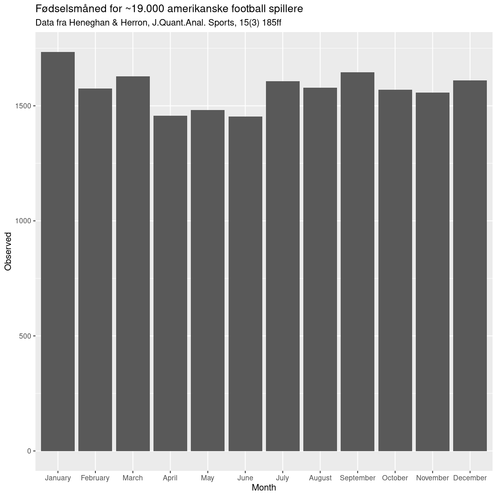
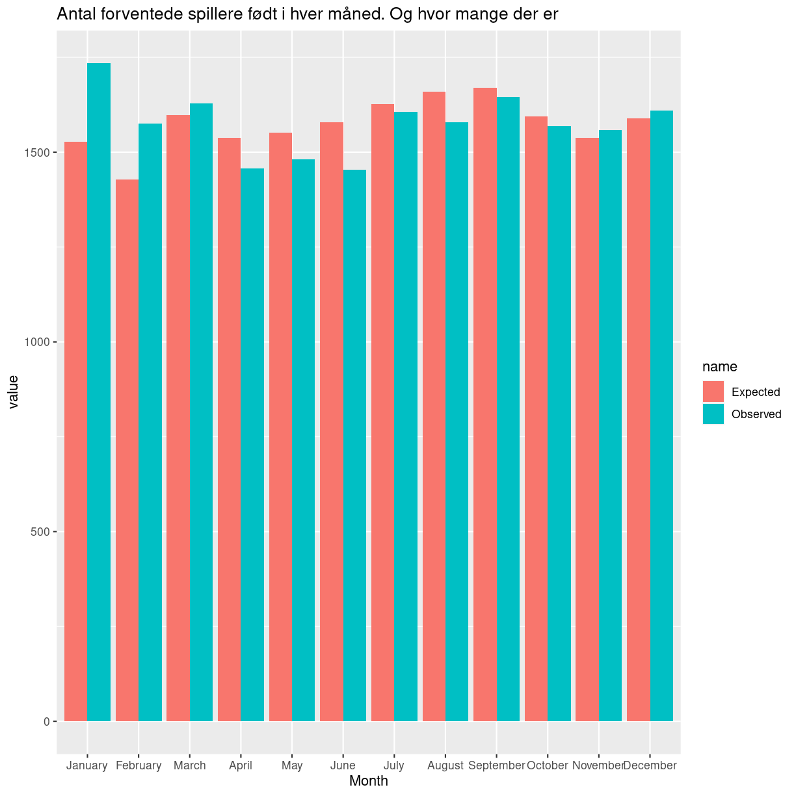

---
# Please do not edit this file directly; it is auto generated.
# Instead, please edit 02-deskriptiv-statistik.md in _episodes_rmd/
title: "Deskriptiv statistik og statistiske deskriptorer"
teaching: 10
exercises: 5
questions:
- "FIXME"
objectives:
- "FIXME"
keypoints:
- "FIXME"
source: Rmd
---

## Hvad er statistik

Før 1980'erne var anbefalingen til folk med mavesår, at de skulle skære ned 
på deres indtag af kaffe. Kaffe, sammen med stress, blev betragtet som en 
hovedårsag til mavesår.

I 1980'erne opdagede Barry Marshall og Robin Warren at de fleste mavesår udløses
af Helicobacter Pylori. Kaffe blev herefter ikke betragtet som ansvarlig for
mavesår, og anbefalingen om at holde sig fra kaffe når man havde mavesår 
forsvandt.

Og i dag er buddet at kaffe godt nok ikke forårsager mavesår, men at et stort
indtag af kaffe kan forværre symptomerne, og forsinke heling af et eksisterende 
mavesår. personer md mavesår anbefales derfor igen at skære ned på kaffen.

Hvordan er man nået frem til det? Det er man ved statistiske undersøgelser.
Man har indsamlet data på livsstilsfaktorer som eksempelvis indtag af kaffe,
og konstateret at patienter med mavesår, indtog mere kaffe end patienter uden. 
Og konkluderet at der nok var en sammenhæng. 

Efter opdagelsen af Helicobacter, har man så fortsat studierne. Og konstateret,
at patienter der er i antibiotika behandling for deres mavesår, opnår dårligere
resultater hvis de drikker meget kaffe.

Det er grundlæggende resultatet af statistiske undersøgelser. 

## Hvad bruger vi statistik til?

Tre ting:
* Mønstre
* Forudsigelser
* Kausalitet

Når vi arbejder med data er vi typisk interesserede i at finde mønstre. Er der 
et mønster der viser at indtagelse af kaffe hænger sammen med mavesår? Gælder det
kun for mænd, eller også for kvinder? Hvor stærk er sammenhængen? Er det kun
10% af vores mavesårspatienter der oplever forværring af deres mors hvis de drikker
kaffe? Eller er det 70%? Er der kun forværring hvis der drikkes mere end en 
kande om dage? Er forværringen værre hvis der drikkes mere kaffe?

Mennesker er gode til at se mønstre - statistik er en måde at få sat vores 
mønstergenkendelse i system, så vi ikke snyder os selv, og ser mønstre hvor der
ingen er. Eller overser dem, fordi mønstrene måske er for subtile til at kan få
øje på dem.

Vi vil også gerne forudsige. Hvis en patient har mavesår, og holder op med at 
drikke kaffe, så skal der gerne ske en bedring - hvis altså der er en sammenhæng.
Vi vil godt kunne forudsige, at hvis en patient lider af hypokaliæmi, så forværres
tilstanden hvis vi ordinerer vanddrivende midler. Og forbedres hvis vi ordinerer
kaliumtabletter. 

Her bevæger vi os over i kausalitet. Det at vi kan forudsige at noget sker hvis
vi foretager en bestemt handling, er ikke det samme som at resultatet skyldes
vores handling. Det klassiske eksempel er salg af solbriller og isvafler. 
Når salget af isvafler stiger, ser vi også et stigende salg af solbriller.
Hvis vi driver en kiosk der sælger begge dele, kan vi, når vi bemærker at 
salget af is stiger, forudsige at så vil salget af solbriller også stige.

Det kunne få os til at tro, at hvis vi sænker prisen på isvafler, og derfor 
sælger flere af dem, så vil vi også
sælge flere solbriller. Men selvom der er en sammenhæng, korrellation, mellem
salget af solbriller og is - så er der ikke en kausal sammenhæng. Den skjulte
faktor der styrer begge dele er vejret. 

Det bruger vi også statistik til. Når vi har fundet vores mønster, og bygget en
model der kan forudsige ting, så kan vi ændre på de forklarende variable. Og se 
om vores forudsigelse stadig holder. Hvis den gør, begynder vi at nærme os
kausalitet.

## Et eksempel
Her har vi et eksempel på et mønster vi kan undre os over. Hvilke måneder er 
amerikanske football (ikke at forveksle med fodbold) spillere født?

~~~
── Attaching core tidyverse packages ──────────────────────── tidyverse 2.0.0 ──
✔ dplyr     1.1.3     ✔ readr     2.1.4
✔ forcats   1.0.0     ✔ stringr   1.5.0
✔ ggplot2   3.4.3     ✔ tibble    3.2.1
✔ lubridate 1.9.2     ✔ tidyr     1.3.0
✔ purrr     1.0.2     
── Conflicts ────────────────────────────────────────── tidyverse_conflicts() ──
✖ dplyr::filter() masks stats::filter()
✖ dplyr::lag()    masks stats::lag()
ℹ Use the conflicted package (<http://conflicted.r-lib.org/>) to force all conflicts to become errors
~~~
{: .output}

plot of chunk unnamed-chunk-2

Det kan man undre sig over. Burde der ikke være lige mange i hver måned?

Hvis vi tænker lidt efter - nej. Januar har 31 dage, februar normalt kun 28.
Der skal være flere spillere der er født i januar end i februar. For der er 
flere der er født i januar end februar.

Vi kan undre os videre. Selvom der kun er 28 dage i februar - så er der flere
spillere der er født i februar end i maj - hvor der er 31 dage. 

Er der en sæson variation? Fødes der måske bare flere børn i februar end i 
maj? Fordi der undfanges flere i maj end i august?

Hvis vi får fat på tallene for hvor mange der i det hele taget fødes i de 
forskellige måneder, kan vi regne ud hvor mange football spillere vi forventer
der skal fødes i en given måned.

Det ser sådan ud:

plot of chunk unnamed-chunk-3

Der er stadig en forskel. Vi ser flere spillere der er født i januar end vi
forventer. Og færre i juni. Er det et tilfælde? Eller er der en grund?

Det første vi skal finde ud af er om det faktisk er et tilfælde. Kaster vi med 
to terninger slår vi undertiden to seksere. Det sker ikke så ofte. Men det sker.
Det kunne også være at den skæve fordeling af football-spillere er et tilfælde.

Det har vi statistiske metoder til at undersøge. De tillader os at afgøre om
fordelingen af football-spillere på de 12 måneder er forskellig fra hvad vi
skulle forvente, og om forskellen er stor nok til at vi kan afvise at det 
er tilfældigt.

Spoiler alert - det er ikke et tilfælde:

~~~
chisq.test(x = am_foot$Observed, p = am_foot$Expected / sum(am_foot$Expected))
~~~
{: .language-r}

~~~

	Chi-squared test for given probabilities

data:  am_foot$Observed
X-squared = 66.164, df = 11, p-value = 6.505e-10
~~~
{: .output}

~~~
combined_matrix <- matrix(c(am_foot$Observed, am_foot$Expected), nrow=2)

# Tilføj kolonnenavne og rækkenavne til matrixen
colnames(combined_matrix) <- am_foot$Month
rownames(combined_matrix) <- c("Observed", "Expected")

# Udfør chi-kvadrat testen
chisq.test(combined_matrix)
~~~
{: .language-r}

~~~

	Pearson's Chi-squared test

data:  combined_matrix
X-squared = 20.516, df = 11, p-value = 0.03874
~~~
{: .output}

Den videnskabelige proces - en cirkel.

En del af hvad der skal være her, er i 04.

At dømme efter øvelserne 

## Beskrivende statistik

tal der beskriver fordelingen.

De data vi har - har en eller anden fordeling. 

Normalfordelingen

Middelværdi
Median
Spredning
Antal
head
summary


