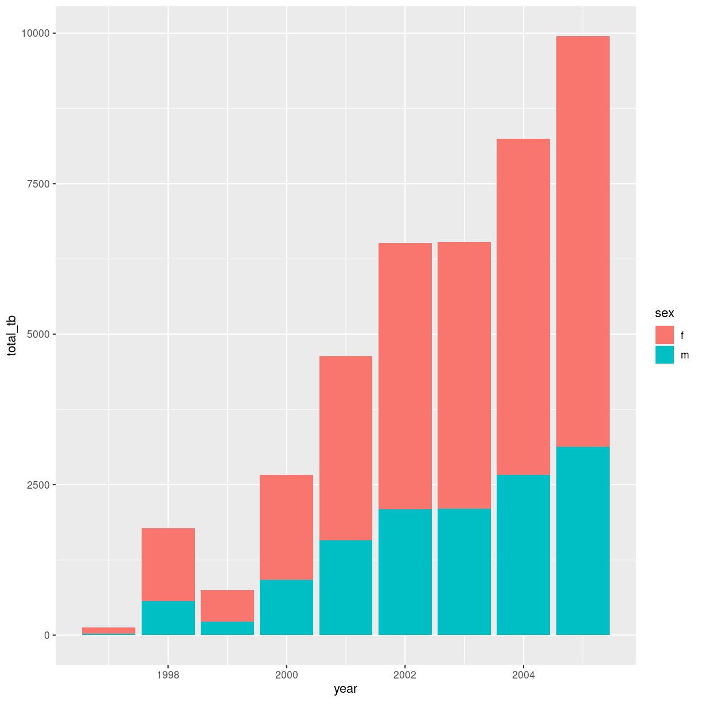

---
# Please do not edit this file directly; it is auto generated.
# Instead, please edit 03-data-jonglering.md in _episodes_rmd/
title: "At jonglere med data"
teaching: 10
exercises: 5
questions:
- "Hvordan manipulerer jeg let mine data?"
objectives:
- "Intruktion af tidyverse funktioner til manipulation af data"
- "Intruktion af tidyverse funktioner til beregning af summary statistics"
- "Intruktion af tidyverse funktioner til visualisering af data"
keypoints:
- "Tidyverse pakkerne giver adgang til meget effektive værktøjer til arbejde med data"
source: Rmd
---

## At jonglere

Meget af det vi skal - foretage statistiske test, bygge modeller, lave tabeller.
Al den slags, er superlet. 

Det svære er at finde ud af hvilken test vi vil foretage, eller hvilken model vi
vil bygge. Det er også svært at tolke data. Men når først vi har fundet ud af hvad
vi vil - så er det ret let. Vi skal "bare" finde den funktion der gør arbejdet for
os. Og så skal vi have jongleret data til at have den form som funktionen tager imod.

Det ser vi på i dette modul.

Vi har allerede set hvordan man kan subsette data. Og hvordan man kan trække en
bestemt kolonne ud af et datasæt. 

Ofte har man brug for at gøre mere end en ting med sit data. Og hvis man
laver et nyt objekt til hver af mellemregningerne, kan man hurtigt tabe overblikket.

Så hvis vi kunne finde en måde at sende den første mellemregning videre til
den næste funktion der skal gøre noget ved vores data. Og måske endda sende
dét resultat videre til en tredie funktion, så kan vi spare en del besvær.

Hvordan gør vi det? Vi kommer her til at vise den lette måde at gøre det på.

## Men allerførst: DATA!

Vi kommer her til at arbejde med det datasæt vi downloadede i sidste lektion.

Vi starter med at indlæse det - bare for det tilfælde at det er blevet væk
undervejs:

~~~
who <- read_csv2("data/who.csv")
~~~
{: .language-r}

~~~
ℹ Using "','" as decimal and "'.'" as grouping mark. Use `read_delim()` for more control.
~~~
{: .output}

~~~
Rows: 405440 Columns: 10
── Column specification ────────────────────────────────────────────────────────
Delimiter: ";"
chr (7): country, iso2, iso3, new, diag, sex, age_low
dbl (3): year, age_high, value

ℹ Use `spec()` to retrieve the full column specification for this data.
ℹ Specify the column types or set `show_col_types = FALSE` to quiet this message.
~~~
{: .output}

Det et datasæt fra WHO, med oplysninger om udbredelsen af tuberkulose. Vi ser på
de første seks rækker:

~~~
head(who)
~~~
{: .language-r}

~~~
# A tibble: 6 × 10
  country     iso2  iso3   year new   diag  sex   age_low age_high value
  <chr>       <chr> <chr> <dbl> <chr> <chr> <chr> <chr>      <dbl> <dbl>
1 Afghanistan AF    AFG    1980 new   sp    m     00            14    NA
2 Afghanistan AF    AFG    1980 new   sp    m     15            24    NA
3 Afghanistan AF    AFG    1980 new   sp    m     25            34    NA
4 Afghanistan AF    AFG    1980 new   sp    m     35            44    NA
5 Afghanistan AF    AFG    1980 new   sp    m     45            54    NA
6 Afghanistan AF    AFG    1980 new   sp    m     55            64    NA
~~~
{: .output}
De første fire kolonner giver (næsten) sig selv. 

new-kolonne er en artefakt fra skabelsen af datasættet. Alle værdier er "new".

diag-kolonnen indeholder oplysninger om hvordan diagnosen er foretaget:

* rel - tilbagefald
* sn - stillet uden mikroskopi af sputum
* sp - stillet ved mikroskopi af sputum
* ep - ekstraplumonal TB

sex-kolonnen angiver kønnet - m for mænd, f for kvinder.

Opgørelsen af antal nye TB tilfælde sker i aldersgrupper, gående fra age_low 
til age_high. 

value-kolonnen indeholder antallet af nye TB-tilfælde for det givne køn, 
aldersgruppe, land, år og diagnostiske metode.

### Pipen

Det var vores data. Nu skal vi manipulere det. Og en grundlæggende operator 
vi kommer til at bruge igen og igen er pipen.

Når vi manipulerer data, skal vi ofte foretage mere end en handling.

Først udvælger vi bestemte kolonner, så udvælger vi bestemte rækker osv

~~~
mellemregning_1 <- select(data, )
mellemregning_2 <- filter(mellemregning_1)
~~~
{: .language-r}

Skal vi foretage mere end et par behandlinger af datasæt, kan vi hurtigt få 
mange mellemregninger. Og det er forvirrende.

Hvis vi havde en måde at sende resultatet af den første manipulation videre til
det næste trin, uden at skulle gemme resultatet undervejs, ville vi kunne spare
en del kode, og minimere forvirringen.

Og hvis vi har et antal funktioner, der alle skal bruge en dataframe som deres
første argument. Og returnerer en dataframe. Så kan vi hægte disse funktioner
sammen. Til det bruger vi pipen: %>% 

Pipen, %>%, tager resultatet af hvad er er på venstre side, og sender det videre
til den funktion der er på højre side. Det tillader os at lave kæder af 
funktioner, der samlet manipulerer vores data.

> ## Er der ikke en nyere pipe?
>
> Pipen kommer oprindeligt fra pakken magrittr. Der er andre nyttige
> udgaver af pipen i samme pakke, men den mest brugte er %>%. Den er så nyttig,
> at base-R, R uden nogen pakker, har introduceret sin egen udgave: |>
> I default installationen af RStudio, er %>% tilgængelig med genvejstasten
> ctrl-shift-m. Indtil default indstillingerne i RStudio bliver ændret, arbejder
> vi med Magrittr pipen, og ikke base-R pipen.
{: .callout}

Lad os prøve. 

Funktionen `head()` tager en dataframe, og viser os de første 6 rækker:

~~~
head(who)
~~~
{: .language-r}

~~~
# A tibble: 6 × 10
  country     iso2  iso3   year new   diag  sex   age_low age_high value
  <chr>       <chr> <chr> <dbl> <chr> <chr> <chr> <chr>      <dbl> <dbl>
1 Afghanistan AF    AFG    1980 new   sp    m     00            14    NA
2 Afghanistan AF    AFG    1980 new   sp    m     15            24    NA
3 Afghanistan AF    AFG    1980 new   sp    m     25            34    NA
4 Afghanistan AF    AFG    1980 new   sp    m     35            44    NA
5 Afghanistan AF    AFG    1980 new   sp    m     45            54    NA
6 Afghanistan AF    AFG    1980 new   sp    m     55            64    NA
~~~
{: .output}

Det kan være vældig nyttigt. Lad os tage et kig på hvordan det fungerer med 
pipen:

~~~
who %>% 
  head()
~~~
{: .language-r}

~~~
# A tibble: 6 × 10
  country     iso2  iso3   year new   diag  sex   age_low age_high value
  <chr>       <chr> <chr> <dbl> <chr> <chr> <chr> <chr>      <dbl> <dbl>
1 Afghanistan AF    AFG    1980 new   sp    m     00            14    NA
2 Afghanistan AF    AFG    1980 new   sp    m     15            24    NA
3 Afghanistan AF    AFG    1980 new   sp    m     25            34    NA
4 Afghanistan AF    AFG    1980 new   sp    m     35            44    NA
5 Afghanistan AF    AFG    1980 new   sp    m     45            54    NA
6 Afghanistan AF    AFG    1980 new   sp    m     55            64    NA
~~~
{: .output}

Pipen tager hvad der står på venstre side, `who` og sender det til funktionen `head()`.
head() funktionen skal have en dataframe, det får den fra pipen.

Det er bøvlet hvis det bare er det vi skal gøre. Men som nævnt sparer det mange
mellemregninger.

## Datamanipulation med Tidyverse

Pakken Tidyverse indeholder en række andre pakker, der alle er karakteriseret
ved at de arbejder godt med pipen. Alle funktioner har som deres første argument
en dataframe, og returnerer selv en dataframe. Det betyder, at vi kan 
hægte funktionerne sammen med pipen.

Når vi manipulerer data, er det særligt den del af tidyverse der hedder dplyr vi
bruger. 

### Udvælge kolonner
Det er ikke alle kolonner vi behøver her. `iso2` og `iso3` er eksempelvis
ikke så anvendelige her. Det er `new` heller ikke. 
Vi kan måske få brug for dem hvis vi skal 
tilføje data fra andre kilder, eller hvis vi skal visualisere data på et kort.

Men de gør ikke noget godt for vores overblik over data. 

Funktionen `select()` udvælger kolonner:

~~~
who %>% 
  select("country") %>% 
  head()
~~~
{: .language-r}

~~~
# A tibble: 6 × 1
  country    
  <chr>      
1 Afghanistan
2 Afghanistan
3 Afghanistan
4 Afghanistan
5 Afghanistan
6 Afghanistan
~~~
{: .output}

Vi sender resultatet videre til `head()`  for ikke at skulle kigge på alle
405.000 rækker.

Vi kan udvælge mere end en kolonne:

~~~
who %>% 
  select(country, year) %>% 
  head()
~~~
{: .language-r}

~~~
# A tibble: 6 × 2
  country      year
  <chr>       <dbl>
1 Afghanistan  1980
2 Afghanistan  1980
3 Afghanistan  1980
4 Afghanistan  1980
5 Afghanistan  1980
6 Afghanistan  1980
~~~
{: .output}
Og vi kan angive at der er kolonner vi ikke vil se på:

~~~
who %>% 
  select(-iso2)
~~~
{: .language-r}

~~~
# A tibble: 405,440 × 9
   country     iso3   year new   diag  sex   age_low age_high value
   <chr>       <chr> <dbl> <chr> <chr> <chr> <chr>      <dbl> <dbl>
 1 Afghanistan AFG    1980 new   sp    m     00            14    NA
 2 Afghanistan AFG    1980 new   sp    m     15            24    NA
 3 Afghanistan AFG    1980 new   sp    m     25            34    NA
 4 Afghanistan AFG    1980 new   sp    m     35            44    NA
 5 Afghanistan AFG    1980 new   sp    m     45            54    NA
 6 Afghanistan AFG    1980 new   sp    m     55            64    NA
 7 Afghanistan AFG    1980 new   sp    m     65            99    NA
 8 Afghanistan AFG    1980 new   sp    f     00            14    NA
 9 Afghanistan AFG    1980 new   sp    f     15            24    NA
10 Afghanistan AFG    1980 new   sp    f     25            34    NA
# ℹ 405,430 more rows
~~~
{: .output}

> ## Øvelse
>
> fjern både iso2, iso3 og new kolonnerne fra datasættet:
>
> > ## Løsning
> > who %>% 
> > 
> >   select(-iso2, -iso3, -new)
> {: .solution}
{: .challenge}

Bemærk at vi ikke fjerner kolonnerne fra vores oprindelige dataframe.

### Udvælge rækker
Det kan være vi er interesserede i specifikke rækker. Eksempelvis alle dem hvor
country er "Afghanistan". 

Funktionen der gør det hedder `filter()`. 

~~~
who %>% 
  select(-c(iso2, iso3, new)) %>% 
  filter(country == "Afghanistan") %>% 
  head()
~~~
{: .language-r}

~~~
# A tibble: 6 × 7
  country      year diag  sex   age_low age_high value
  <chr>       <dbl> <chr> <chr> <chr>      <dbl> <dbl>
1 Afghanistan  1980 sp    m     00            14    NA
2 Afghanistan  1980 sp    m     15            24    NA
3 Afghanistan  1980 sp    m     25            34    NA
4 Afghanistan  1980 sp    m     35            44    NA
5 Afghanistan  1980 sp    m     45            54    NA
6 Afghanistan  1980 sp    m     55            64    NA
~~~
{: .output}

Bemærk at vi skriver "==". Vi specificerer at vi vil have de rækker hvor det 
udtryk der står i funktionen er sandt. Altså her at der i "country" står
"Afghanistan". Bemærk også, at i stedet for at sætte minus foran alle de
kolonner vi ikke vil se på, kan vi samle dem i en vektor med `c()` funktionen,
og sætte et minus foran den.

> ## Øvelse
>
> Udvælg de rækker hvor der er data om tuberkolose blandt drengebørn i alderen
> 0 til 14 for Afghanistan. 
>
> Hint: Vi kan tilføje mere end et kriterium i samme filter funktion
>
> > ## Løsning
> > who %>% 
> > 
> > filter(country == "Afghanistan", sex == "m", age_low == "00")
> {: .solution}
{: .challenge}

### Lave nye kolonner baseret på eksisterende

Læg mærke til kolonneoverskrifterne. `age_low` kolonnen har "<chr>" stående.
Det indikerer at kolonnen indeholder tekst, og ikke tal. Under `age_high` 
står der "<dbl>". Det indikerer at kolonnen indeholder tal.

Vi vil godt have lavet den nedre aldersgrænse om til tal.

Og det gør vi ved at tage den eksisterende kolonne `age_low` og erstatte den med
en ny kolonne, der hedder det samme - men som indeholder tal.

~~~
who %>% 
  mutate(age_low = as.numeric(age_low)) %>% 
  head()
~~~
{: .language-r}

~~~
# A tibble: 6 × 10
  country     iso2  iso3   year new   diag  sex   age_low age_high value
  <chr>       <chr> <chr> <dbl> <chr> <chr> <chr>   <dbl>    <dbl> <dbl>
1 Afghanistan AF    AFG    1980 new   sp    m           0       14    NA
2 Afghanistan AF    AFG    1980 new   sp    m          15       24    NA
3 Afghanistan AF    AFG    1980 new   sp    m          25       34    NA
4 Afghanistan AF    AFG    1980 new   sp    m          35       44    NA
5 Afghanistan AF    AFG    1980 new   sp    m          45       54    NA
6 Afghanistan AF    AFG    1980 new   sp    m          55       64    NA
~~~
{: .output}
as.numeric() tager tekstinput, og konverterer det til et tal - hvis det kan gøres
automatisk. Og det kan det i dette tilfælde.

Nu kan vi lave matematik på den kolonne, og lave en ny kolonne hvor vi beregner 
aldersintervallet i rækkerne:

~~~
who %>% 
    mutate(age_low = as.numeric(age_low)) %>% 
    mutate(interval = age_high - age_low) %>% 
  select(country, year, interval) %>% 
  head()
~~~
{: .language-r}

~~~
# A tibble: 6 × 3
  country      year interval
  <chr>       <dbl>    <dbl>
1 Afghanistan  1980       14
2 Afghanistan  1980        9
3 Afghanistan  1980        9
4 Afghanistan  1980        9
5 Afghanistan  1980        9
6 Afghanistan  1980        9
~~~
{: .output}

Vi kan altså bruge `mutate()` funktionen både til at lave om på eksisterende
kolonner. Og til at lave nye kolonner, baseret på data i de kolonner i allerede 
har.

### Kategoriske variable

Som omtalt er kategoriske variable specielle. De kan kun tage en enkelt værdi.

Funktioner, modeller osv i R har ingen problemer med at arbejde med kategoriske
data. De skal blot vide at det er kategoriske data. Og det markerer vi på en 
særlig måde i R - det kaldes `factor`.

I dette tilfælde er lande en kategorisk værdi. Enten er tallene fra Afghanistan.
Eller også er de fra Australien.

Når vi vil sikre at en kategorisk værdi behandles som en kategorisk værdi,
bruger vi funktionen `factor()`:

~~~
who %>% 
  mutate(country = factor(country)) %>% 
  head()
~~~
{: .language-r}

~~~
# A tibble: 6 × 10
  country     iso2  iso3   year new   diag  sex   age_low age_high value
  <fct>       <chr> <chr> <dbl> <chr> <chr> <chr> <chr>      <dbl> <dbl>
1 Afghanistan AF    AFG    1980 new   sp    m     00            14    NA
2 Afghanistan AF    AFG    1980 new   sp    m     15            24    NA
3 Afghanistan AF    AFG    1980 new   sp    m     25            34    NA
4 Afghanistan AF    AFG    1980 new   sp    m     35            44    NA
5 Afghanistan AF    AFG    1980 new   sp    m     45            54    NA
6 Afghanistan AF    AFG    1980 new   sp    m     55            64    NA
~~~
{: .output}
Nu er `country` variable kategorisk. Det var den sådan set også før. Men nu ved
R det!

### Opsummering af data i kolonner

Hvor mange nye tilfælde af TB var der i Afghanistan i 1997?

Det er en opsummering. Så funktionen der skal bruges hedder summarise:

~~~
who %>% 
  filter(iso2 == "AF", 
         year == 1997) %>% 
  summarise(total_tb = sum(value, na.rm = T))
~~~
{: .language-r}

~~~
# A tibble: 1 × 1
  total_tb
     <dbl>
1      128
~~~
{: .output}
Der er manglende værdier. Og den slags skal kodes med `NA`. Inden vi kan lave 
matematik på kolonner der indeholder manglende værdier, skal de fjernes. Og 
det kan vi specificere med na.rm = T.

Summarise kan opsummere meget andet, i dette tilfælde giver det ikke mening
at beregne standardafvigelser, men i princippet kan alle summary-statistik
funktioner lægges ind her:

~~~
who %>% 
  filter(iso2 == "AF",
         year == 1997) %>% 
  summarise(total_tb = sum(value, na.rm = T),
            stdaf_tb = sd(value, na.rm = T))
~~~
{: .language-r}

~~~
# A tibble: 1 × 2
  total_tb stdaf_tb
     <dbl>    <dbl>
1      128     12.5
~~~
{: .output}

### Grupper dataframes

Det var for 1997. Hvordan så det ud for 1998? Vi kunne ændre på værdien i 
`filter`. Og samle resultaterne for hvert år. Det bliver træls når vi også 
skal have værdierne for 1999, 2000, 2001 etc.

I stedet grupperer vi dataframen:

~~~
who %>% 
  filter(iso2 == "AF",
         year > 1996,
         year < 2006) %>% 
  group_by(year) %>% 
  summarise(total_tb = sum(value, na.rm=T))
~~~
{: .language-r}

~~~
# A tibble: 9 × 2
   year total_tb
  <dbl>    <dbl>
1  1997      128
2  1998     1778
3  1999      745
4  2000     2666
5  2001     4639
6  2002     6509
7  2003     6528
8  2004     8245
9  2005     9949
~~~
{: .output}
Vi har filtreret på årstal for at få en overskuelig tabel, men det er i `group_by` 
magien sker.

Skal vi have tabellen ud i et pænt format i vores RMarkdown, kan vi med fordel
sende resultatet videre til funktionen `kable` der formatterer den pænt (eller 
pænere). Den kommer fra pakken/biblioteket `knitr`:

~~~
library(knitr)
who %>% 
  filter(iso2 == "AF",
         year > 1996,
         year < 2006) %>% 
  group_by(year) %>% 
  summarise(total_tb = sum(value, na.rm=T)) %>% 
  kable()
~~~
{: .language-r}

| year| total_tb|
|----:|--------:|
| 1997|      128|
| 1998|     1778|
| 1999|      745|
| 2000|     2666|
| 2001|     4639|
| 2002|     6509|
| 2003|     6528|
| 2004|     8245|
| 2005|     9949|

Vi kan gruppere efter mere end en variabel. Er der eksempelvis forskel på
hvor mange tilfælde af TB der diagnosticeres mellem kønnene?

~~~
who %>% 
  filter(iso2 == "AF",
         year > 1996,
         year < 2006) %>% 
  group_by(year, sex) %>% 
  summarise(total_tb = sum(value, na.rm=T))
~~~
{: .language-r}

~~~
`summarise()` has grouped output by 'year'. You can override using the
`.groups` argument.
~~~
{: .output}

~~~
# A tibble: 18 × 3
# Groups:   year [9]
    year sex   total_tb
   <dbl> <chr>    <dbl>
 1  1997 f          102
 2  1997 m           26
 3  1998 f         1207
 4  1998 m          571
 5  1999 f          517
 6  1999 m          228
 7  2000 f         1751
 8  2000 m          915
 9  2001 f         3062
10  2001 m         1577
11  2002 f         4418
12  2002 m         2091
13  2003 f         4423
14  2003 m         2105
15  2004 f         5587
16  2004 m         2658
17  2005 f         6818
18  2005 m         3131
~~~
{: .output}
Det er ikke en specielt let-læselig tabel. Det ville være rart hvis vi 
fik en tabel hvor antallet af TB-tilfælde for hvert køn, stod i hver sin 
kolonne.

Det er en såkaldt pivotering. Og det gøres på denne måde:

~~~
who %>% 
  filter(iso2 == "AF",
         year > 1996,
         year < 2006) %>% 
  group_by(year, sex) %>% 
  summarise(total_tb = sum(value, na.rm=T)) %>% 
  pivot_wider(names_from = sex, values_from = total_tb)
~~~
{: .language-r}

~~~
`summarise()` has grouped output by 'year'. You can override using the
`.groups` argument.
~~~
{: .output}

~~~
# A tibble: 9 × 3
# Groups:   year [9]
   year     f     m
  <dbl> <dbl> <dbl>
1  1997   102    26
2  1998  1207   571
3  1999   517   228
4  2000  1751   915
5  2001  3062  1577
6  2002  4418  2091
7  2003  4423  2105
8  2004  5587  2658
9  2005  6818  3131
~~~
{: .output}
Vi laver en pivot_wider, fordi vi godt vil have en bredere, "wider" tabel.
Vi skal angive en kolonne der indeholder de værdier vi godt vil have skal være kolonneoverskrifter
bagefter. Og en kolonne der indeholder de værdier vi gerne vil have i tabellen.

Tilsvarende kan vi gøre en bred kolonne længere (og smallere) med funktionen
`pivot_longer`. Hvis vi godt vil have tabellen ovenfor tilbage til sin oprindelige
form, kan vi bruge den funktion. Operationen er den samme, bare den anden vej:

Vi havde en kolonne med værdier der blev til kolonneoverskrifter. Her blev en kolonne
til to. Og vi havde en kolonne der indeholdet de værdier der skulle placeres 
under de to nye kolonner.

Så nu angiver vi hvilke af kolonnerne i den brede tabel der skal blive til værdier
i en kolonne i den smalle tabel. Og hvad den kolonne skal hedde. Det er ikke 
nødvendigt at angive hvilke kolonner værdierne skal komme fra, det er jo de samme
som vi starter med at angive:

~~~
who %>% 
  filter(iso2 == "AF",
         year > 1996,
         year < 2006) %>% 
  group_by(year, sex) %>% 
  summarise(total_tb = sum(value, na.rm=T)) %>% 
  pivot_wider(names_from = sex, values_from = total_tb) %>% 
  pivot_longer(cols = c(f, m), names_to = "sex", )
~~~
{: .language-r}

~~~
`summarise()` has grouped output by 'year'. You can override using the
`.groups` argument.
~~~
{: .output}

~~~
# A tibble: 18 × 3
# Groups:   year [9]
    year sex   value
   <dbl> <chr> <dbl>
 1  1997 f       102
 2  1997 m        26
 3  1998 f      1207
 4  1998 m       571
 5  1999 f       517
 6  1999 m       228
 7  2000 f      1751
 8  2000 m       915
 9  2001 f      3062
10  2001 m      1577
11  2002 f      4418
12  2002 m      2091
13  2003 f      4423
14  2003 m      2105
15  2004 f      5587
16  2004 m      2658
17  2005 f      6818
18  2005 m      3131
~~~
{: .output}

Lad os lige se på den brede tabel igen:

~~~
who %>% 
  filter(iso2 == "AF",
         year > 1996,
         year < 2006) %>% 
  group_by(year, sex) %>% 
  summarise(total_tb = sum(value, na.rm=T)) %>% 
  pivot_wider(names_from = sex, values_from = total_tb)
~~~
{: .language-r}

~~~
`summarise()` has grouped output by 'year'. You can override using the
`.groups` argument.
~~~
{: .output}

~~~
# A tibble: 9 × 3
# Groups:   year [9]
   year     f     m
  <dbl> <dbl> <dbl>
1  1997   102    26
2  1998  1207   571
3  1999   517   228
4  2000  1751   915
5  2001  3062  1577
6  2002  4418  2091
7  2003  4423  2105
8  2004  5587  2658
9  2005  6818  3131
~~~
{: .output}
Det kunne være rart med mere meningsfyldte kolonnenavne. Det kan vi give
dem med funktionen `rename()`:

~~~
who %>% 
  filter(iso2 == "AF",
         year > 1996,
         year < 2006) %>% 
  group_by(year, sex) %>% 
  summarise(total_tb = sum(value, na.rm=T)) %>% 
  pivot_wider(names_from = sex, values_from = total_tb) %>% 
  rename("female" = f,
         "male" = m)
~~~
{: .language-r}

~~~
`summarise()` has grouped output by 'year'. You can override using the
`.groups` argument.
~~~
{: .output}

~~~
# A tibble: 9 × 3
# Groups:   year [9]
   year female  male
  <dbl>  <dbl> <dbl>
1  1997    102    26
2  1998   1207   571
3  1999    517   228
4  2000   1751   915
5  2001   3062  1577
6  2002   4418  2091
7  2003   4423  2105
8  2004   5587  2658
9  2005   6818  3131
~~~
{: .output}

## Tidy-format - og plots

Det brede format er lettere for mennesker at læse. Men det lange er lettere
for computere. Formatet kaldes ofte for `tidy` - det er derfor 
pakken vi indlæste kaldes `tidyverse`. Så lad os kigge på den lange tabel igen:

~~~
AF9606 <- who %>% 
  filter(iso2 == "AF",
         year > 1996,
         year < 2006) %>% 
  group_by(year, sex) %>% 
  summarise(total_tb = sum(value, na.rm=T))
~~~
{: .language-r}

~~~
`summarise()` has grouped output by 'year'. You can override using the
`.groups` argument.
~~~
{: .output}

~~~
AF9606
~~~
{: .language-r}

~~~
# A tibble: 18 × 3
# Groups:   year [9]
    year sex   total_tb
   <dbl> <chr>    <dbl>
 1  1997 f          102
 2  1997 m           26
 3  1998 f         1207
 4  1998 m          571
 5  1999 f          517
 6  1999 m          228
 7  2000 f         1751
 8  2000 m          915
 9  2001 f         3062
10  2001 m         1577
11  2002 f         4418
12  2002 m         2091
13  2003 f         4423
14  2003 m         2105
15  2004 f         5587
16  2004 m         2658
17  2005 f         6818
18  2005 m         3131
~~~
{: .output}
Vi har her gemt resultatet i objektet `AF9606` så vi let kan arbejde videre med
det.

En af fordelene ved det lange, tidy format er, at det også bliver let at 
lave plots.

Den funktion vi bruger til det hedder `ggplot()`. Vi kommer ikke til at gå i 
detaljer med den her, men det fungerer på denne måde:

~~~
AF9606 %>% 
  ggplot(aes(x = year, y = total_tb, fill = sex)) +
  geom_col()
~~~
{: .language-r}

plot of chunk unnamed-chunk-25

`ggplot()` funktionen får sine data via pipen ` %>% `. I ggplot funktionen
fortæller vi at vi vil have `year` på x-aksen. Vi vil have antallet af TB-tilfælde
på y-aksen. Og vi vil have farvelagt ting baseret på sex. 

Det i sig selv giver ikke et plot, men det gør det så snart vi tilføjer, med 
et `+` en ekstra funktion, `geom_col()` der laver et søjle diagram.

Det fikse er at vi ret let kan ændre på hvad vi vil have plottet:

~~~
AF9606 %>% 
  ggplot(aes(x = year, y = total_tb, fill = sex)) +
  geom_point()
~~~
{: .language-r}

plot of chunk unnamed-chunk-26

Ved blot at ændre `geom_col()` til `geom_point()` får vi et scatter plot i stedet
for et søjlediagram. 

De indbyggede plottefunktioner i R er ret gode, og til de fleste formål alt rigeligt.
Men hvis man vil justere på farver eller lave mange plots, så kan det være en 
udfordring

`ggplot()` kan også spare en del mellemregninger, hvis man vil sammenligne data.

Hvis vi vil lave et histogram over FEV for rygende børn, et for ikke-rygende 
børn med de indbyggede funktioner, skulle vi først bruge `subset()` funktionen
for at lave mindre datasæt, et for hver gruppe.

Med `ggplot()` er der genveje:

~~~
Rows: 654 Columns: 6
── Column specification ────────────────────────────────────────────────────────
Delimiter: ","
dbl (6): Id, Age, FEV, Hgt, Sex, Smoke

ℹ Use `spec()` to retrieve the full column specification for this data.
ℹ Specify the column types or set `show_col_types = FALSE` to quiet this message.
~~~
{: .output}

~~~
FEV %>% 
  ggplot(aes(x = FEV)) +
  geom_histogram() +
  facet_wrap(~Smoke)
~~~
{: .language-r}

~~~
`stat_bin()` using `bins = 30`. Pick better value with `binwidth`.
~~~
{: .output}

plot of chunk unnamed-chunk-28

`facet_wrap(~Smoke)` fortæller `ggplot()` at vi godt vil have lavet et histogram
for hver guppe der er i "Smoke" kolonnnen.


