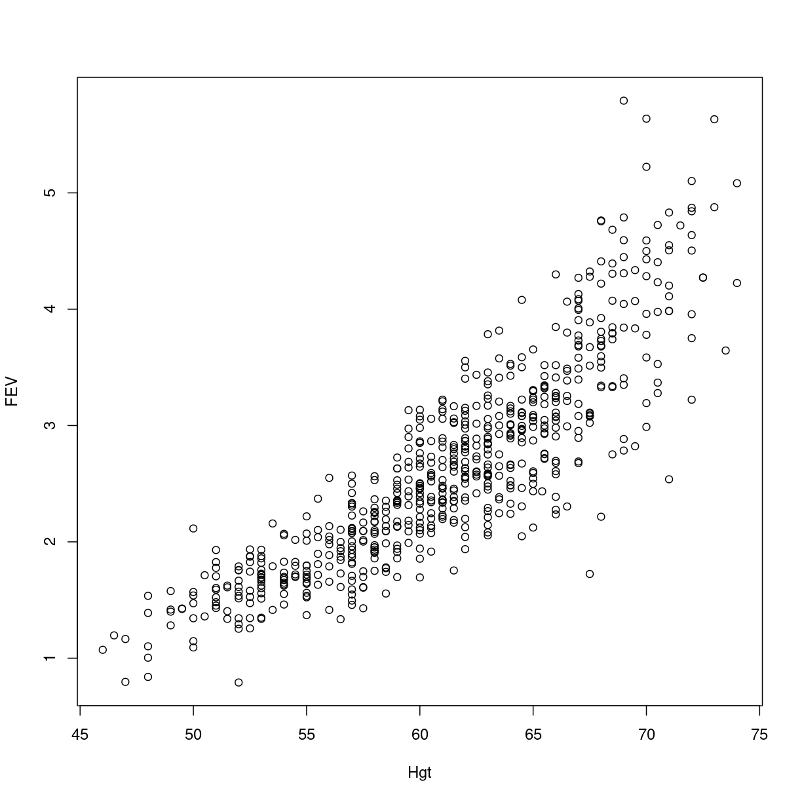
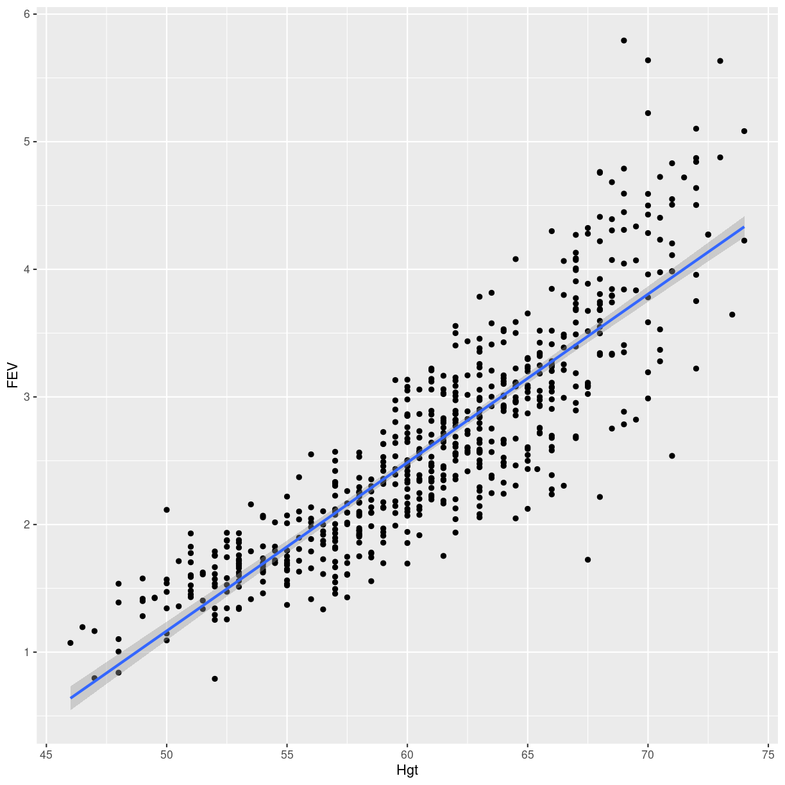

---
# Please do not edit this file directly; it is auto generated.
# Instead, please edit 04-lineære-modeller.md in _episodes_rmd/
title: "Lineære modeller"
teaching: 10
exercises: 5
questions:
- "Hvordan fitter jeg en lineær model i R?"
objectives:
- "FIXME"
keypoints:
- "FIXME"
source: Rmd
---

# NB - denne side er til dag 2 - og ikke helt færdig.

Vi genbesøger lige fev datasættet:

~~~
fev <- read_csv("data/FEV.csv")
~~~
{: .language-r}

~~~
Rows: 654 Columns: 6
── Column specification ────────────────────────────────────────────────────────
Delimiter: ","
dbl (6): Id, Age, FEV, Hgt, Sex, Smoke

ℹ Use `spec()` to retrieve the full column specification for this data.
ℹ Specify the column types or set `show_col_types = FALSE` to quiet this message.
~~~
{: .output}

Det så således ud:

~~~
fev %>% head()
~~~
{: .language-r}

~~~
# A tibble: 6 × 6
     Id   Age   FEV   Hgt   Sex Smoke
  <dbl> <dbl> <dbl> <dbl> <dbl> <dbl>
1   301     9  1.71  57       0     0
2   451     8  1.72  67.5     0     0
3   501     7  1.72  54.5     0     0
4   642     9  1.56  53       1     0
5   901     9  1.90  57       1     0
6  1701     8  2.34  61       0     0
~~~
{: .output}

Inden man bygger modeller, er det en god ide at lave et scatterplot:

~~~
plot(FEV ~ Hgt, dat = fev)
~~~
{: .language-r}

plot of chunk unnamed-chunk-5

Det kunne godt se lineært ud.

Når vi laver en lineær model, skal vi angive modellen på en særlig måde. 
I R kaldes det for `formel-notation` og `FEV ~ Hgt` dækker over at vi godt vil
forklare FEV som funktion af Hgt. Altså en model hvor vi forestiller os at 
Forced Expiratory Volume er en lineær funktion af børnenes højde.

Funktionen der laver vores lineære model hedder `lm()` og skal også have at vide,
at det data vi bruger, hedder fev:

~~~
model <- lm(FEV ~ Hgt, data = fev)
~~~
{: .language-r}

Det output vi får direkte er ikke særligt nyttigt. Derfor gemmer vi resultatet i
et objekt, her kalder vi det `model`. 

Outputtet direkte ser således ud:

~~~
model
~~~
{: .language-r}

~~~

Call:
lm(formula = FEV ~ Hgt, data = fev)

Coefficients:
(Intercept)          Hgt  
     -5.433        0.132  
~~~
{: .output}

Det giver os skæring og hældning. Men vi vil godt vide lidt mere:

~~~
summary(model)
~~~
{: .language-r}

~~~

Call:
lm(formula = FEV ~ Hgt, data = fev)

Residuals:
     Min       1Q   Median       3Q      Max 
-1.75167 -0.26619 -0.00401  0.24474  2.11936 

Coefficients:
             Estimate Std. Error t value Pr(>|t|)    
(Intercept) -5.432679   0.181460  -29.94   <2e-16 ***
Hgt          0.131976   0.002955   44.66   <2e-16 ***
---
Signif. codes:  0 '***' 0.001 '**' 0.01 '*' 0.05 '.' 0.1 ' ' 1

Residual standard error: 0.4307 on 652 degrees of freedom
Multiple R-squared:  0.7537,	Adjusted R-squared:  0.7533 
F-statistic:  1995 on 1 and 652 DF,  p-value: < 2.2e-16
~~~
{: .output}

Ikke meget lineær. men ret.

Prøv selv!

> ## Øvelse
>
> Download datasættet BONEDEN til din datamappe
>
> https://raw.githubusercontent.com/KUBDatalab/R-PUFF/main/data/BONEDEN.csv
>
> Indlæs det derefter med read_csv til et objekt. Kald objektet boneden (med små bogstaver)
>
> Lav dernæst en lineær regression af `tea1` mod `cof1`
>
> > ## Løsning
> > download.file("https://raw.githubusercontent.com/KUBDatalab/R-PUFF/main/data/BONEDEN.csv", "data/BONEDEN.csv", mode = "wb")
> > 
> > boneden <- read_csv("data/BONEDEN.csv)
> >
> > lm(tea1 ~ cof1, data = boneden)
> > 
> >   select(-iso2, -iso3, -new)
> {: .solution}
{: .challenge}

> ## Øvelse 2 - spredning og middelværdier på indtag af te.
>
> Fortsæt arbejdet med datasættet boneden
>
> Beregn middelværdi, median og standardafvigelser på indtaget af te (`tea1`)
> og kaffe (`cof1`)
>
> Lav et scatterplot af `tea1` mod `cof1` 
>
> > ## Løsning
> > 
> > mean(boneden$tea1)
> >
> > mean(boneden$cof1)
> > 
> > median(boneden$tea1)
> > 
> > median(boneden$cof1)
> > 
> > plot(boneden$tea1, boneden$cof1)
> >
> > eller:
> >
> > boneden %>% 
> >
> >   ggplot(aes(x = cof1, y = tea1)) +
> >
> >   geom_point()
> >
> {: .solution}
{: .challenge}

Undertiden kan vi have behov for at få resultaterne ud i en tabel.

Hvis vi installerer pakken `broom`, får vi adgang til funktion `tidy()` der
piller de mest interessante data ud til os:

~~~
library(broom)
tidy(model)
~~~
{: .language-r}

~~~
# A tibble: 2 × 5
  term        estimate std.error statistic   p.value
  <chr>          <dbl>     <dbl>     <dbl>     <dbl>
1 (Intercept)   -5.43    0.181       -29.9 1.45e-124
2 Hgt            0.132   0.00295      44.7 1.57e-200
~~~
{: .output}

Og vil vi have et endnu mere lækkert format, kan vi installere pakken `stargazer`,
der har en funktion der hedder - wait for it - `stargazer()` der kan formattere
ting pænt for os. Her vælger vi `type="text"` der egner sig fint til dette 
output format, men andre muligheder findes:

~~~
library(stargazer)
~~~
{: .language-r}

~~~

Please cite as: 
~~~
{: .output}

~~~
 Hlavac, Marek (2022). stargazer: Well-Formatted Regression and Summary Statistics Tables.
~~~
{: .output}

~~~
 R package version 5.2.3. https://CRAN.R-project.org/package=stargazer 
~~~
{: .output}

~~~
stargazer(model, type="text")
~~~
{: .language-r}

~~~

===============================================
                        Dependent variable:    
                    ---------------------------
                                FEV            
-----------------------------------------------
Hgt                          0.132***          
                              (0.003)          
                                               
Constant                     -5.433***         
                              (0.181)          
                                               
-----------------------------------------------
Observations                    654            
R2                             0.754           
Adjusted R2                    0.753           
Residual Std. Error      0.431 (df = 652)      
F Statistic         1,994.731*** (df = 1; 652) 
===============================================
Note:               *p<0.1; **p<0.05; ***p<0.01
~~~
{: .output}

Det kunne godt se lineært ud. Går vi over i `ggplot`-universet, kan vi relativt
let lave det samme, nu med en lineær regressionslinie lagt ind også:

~~~
fev %>% 
  ggplot(aes(x = Hgt, y = FEV)) +
  geom_point() +
  geom_smooth(method="lm")
~~~
{: .language-r}

~~~
`geom_smooth()` using formula = 'y ~ x'
~~~
{: .output}

plot of chunk unnamed-chunk-11

Det er `method="lm"` der angiver at det skal være en lineær linie der skal
ligges ind. 

Hvis vi godt vil have konfidensintervaller på parametrene i vores model, er der 
en funktion til det:

~~~
confint(model)
~~~
{: .language-r}

~~~
                 2.5 %    97.5 %
(Intercept) -5.7889951 -5.076363
Hgt          0.1261732  0.137778
~~~
{: .output}

Vi har tidligere lært, at den nedre værdi for konfidensintervallet, finder vi
ved at trække 1.96 ganget med standardfejlen fra estimatet. Og den øvre 
ved at lægge til i stedet. Lad os lige tjekke efter:

~~~
0.131976 + c(-1, 1)* 1.96* 0.002955
~~~
{: .language-r}

~~~
[1] 0.1261842 0.1377678
~~~
{: .output}
Det stemmer ikke helt. Det skyldes at 1.96 ikke er den _helt_ rigtige værdi.

Hvis vi godt vil have den helt præcist kan vi få det:

~~~
qt(0.975, nrow(fev)-2)
~~~
{: .language-r}

~~~
[1] 1.9636090861258468
~~~
{: .output}

1.96 er nok til de fleste formål.

Hvis vi ikke vil nøjes med et 95% interval, kan vi specificere et andet:

~~~
confint(model, level = 0.99)
~~~
{: .language-r}

~~~
                 0.5 %     99.5 %
(Intercept) -5.9014606 -4.9638970
Hgt          0.1243418  0.1396094
~~~
{: .output}

Dette kunne også være en øvelse:

~~~
drenge <- fev %>% 
  filter(Sex == 0)

piger <- fev %>% 
  filter(Sex == 1)
~~~
{: .language-r}

~~~
lm(FEV ~ Hgt, data = drenge) %>% summary()
~~~
{: .language-r}

~~~

Call:
lm(formula = FEV ~ Hgt, data = drenge)

Residuals:
     Min       1Q   Median       3Q      Max 
-1.54654 -0.20323  0.01498  0.22968  1.02038 

Coefficients:
             Estimate Std. Error t value Pr(>|t|)    
(Intercept) -4.318219   0.252449  -17.11   <2e-16 ***
Hgt          0.112426   0.004179   26.90   <2e-16 ***
---
Signif. codes:  0 '***' 0.001 '**' 0.01 '*' 0.05 '.' 0.1 ' ' 1

Residual standard error: 0.3566 on 316 degrees of freedom
Multiple R-squared:  0.696,	Adjusted R-squared:  0.6951 
F-statistic: 723.6 on 1 and 316 DF,  p-value: < 2.2e-16
~~~
{: .output}

~~~
lm(FEV ~ Hgt, data = piger) %>% summary()
~~~
{: .language-r}

~~~

Call:
lm(formula = FEV ~ Hgt, data = piger)

Residuals:
     Min       1Q   Median       3Q      Max 
-1.13438 -0.30820 -0.00568  0.30821  2.00491 

Coefficients:
             Estimate Std. Error t value Pr(>|t|)    
(Intercept) -5.863848   0.254470  -23.04   <2e-16 ***
Hgt          0.139883   0.004082   34.27   <2e-16 ***
---
Signif. codes:  0 '***' 0.001 '**' 0.01 '*' 0.05 '.' 0.1 ' ' 1

Residual standard error: 0.4729 on 334 degrees of freedom
Multiple R-squared:  0.7786,	Adjusted R-squared:  0.7779 
F-statistic:  1175 on 1 and 334 DF,  p-value: < 2.2e-16
~~~
{: .output}

## Et andet datasæt


