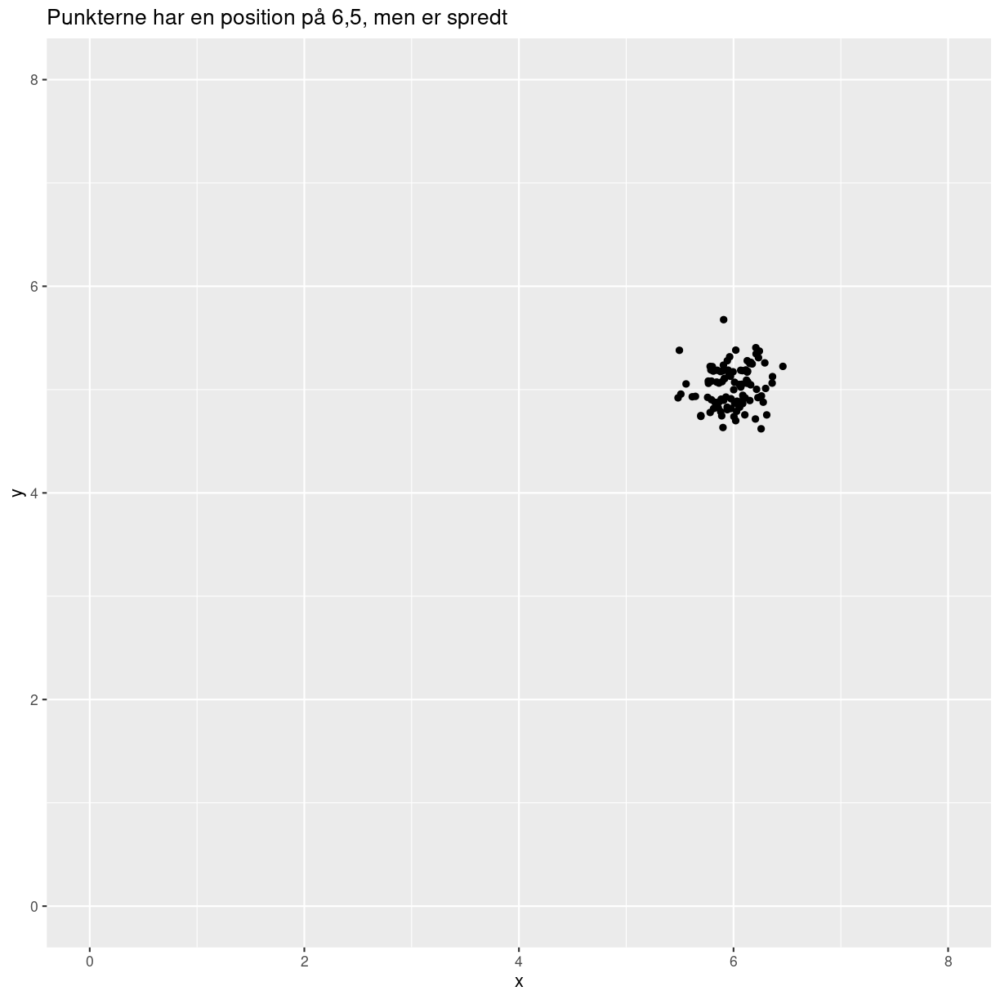

---
# Please do not edit this file directly; it is auto generated.
# Instead, please edit 04-presentation-table1.md in _episodes_rmd/
title: "Datapræsentation og tabel 1"
teaching: 10
exercises: 5
questions:
- "FIXME"
objectives:
- "FIXME"
keypoints:
- "FIXME"
source: Rmd
---

# Den Store Tabel 1

Vi ønsker at sige noget om en population. Hele befolkningen, alle fodboldspillere,
alle børn under 4 år, alle kvinder over 50. 

Vi kan ikke meningsfuldt undersøge dem alle (vi ser her bort fra registerdata,
hvor det faktisk er muligt at undersøge hele den danske population). Så vi udvælger
en studiepopulation, en stikprøve.

Denne stikprøve ønsker vi at beskrive. Er den repræsentativ? Kan vi generalisere
ud fra den?

Når vi laver forskning af denne type, er det første vi gør normalt at vise en 
tabel der giver os deskriptiv statistik på denne studiepopulation, eller stikprøve.
Tabeller nummeres fortløbende, så den første er nummer 1 - table one.

Det kan være ting som - hvad er gennemsnitsalderen? Hvad er variationen i alder?
Hvad er kønsfordelingen? Hvor ofte optræder det fænomen vi ønsker at undersøge?

## Datatyper

Afhængigt af hvad vi undersøger, er der to typer variable: 

* Kvantitative. Typisk noget vi måler. De er numeriske, evt. også kontinuerte
* Kvalitative. Typisk kategoriske - enten er individet i denne gruppe. Eller også er hun ikke.

De kvantitative kunne være:
* alder
* højde
* dagligt vitamin C indtag
* indkomst

De kvalitative kunne være:
* Køn
* Hårfarve
* Socialklasse

### Deskriptiv statistik for kvantitative variable

De kvantitative variable beskrives normalt med en typisk værdi - undertiden kaldet
forventningsværdien, og en variation. Man kan også beskrive det som en position og en
spredning.

~~~
data.frame(x = rnorm(100, 6, sd = .2), y = rnorm(100, 5, sd = .2)) %>% 
  ggplot(aes(x,y)) +
  geom_point() +
  ylim(c(0,8)) +
  xlim(0,8) +
  ggtitle("Punkterne har en position på 6,5, men er spredt")
~~~
{: .language-r}

plot of chunk unnamed-chunk-2

Når vi angiver de typiske værdier, bruger vi normalt gennemsnit, eller medianen.

Variationen beskriver vi typisk med enten spredningen (standardafvigelse, på 
engelsk standard deviation), eller IQR: Inter-Quartile Range.

vi bruger dem typisk i kombination - gennemsnit sammen med standardafvigelse, 
median sammen med IQR. og så er vi nomalt gladest for at bruge gennemsnit og 
spredning på symmetriske fordelinger. 

Hvad er standardafvigelsen?

### Deskriptiv statistik for kvalitative variable

Kategoriske vairable beskriver vi normalt med frekvens og andel (som blot er 
den relative frekvens)

Eksempel - der var 660 personer i undersøgelsen. 200 var mænd. Frekvensen af 
mænd var 200. Og den relative frekvens var 200/660 = 

Hvordan ser table1 så ud, og hvordan laver vi den? Hvilke krav stilles til 
hvordan data ser ud?

Meget af ovenstående hører hjemme under 02.

~~~
library(tableone)
~~~
{: .language-r}


