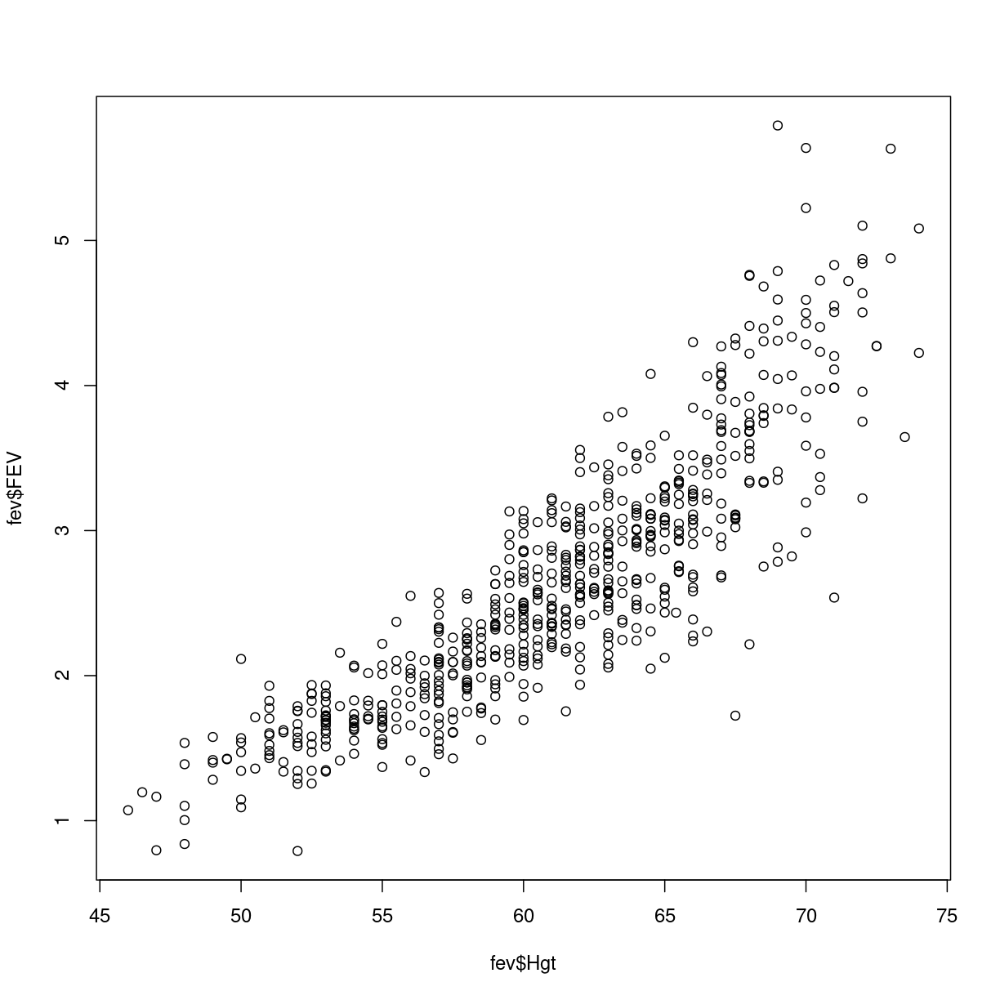
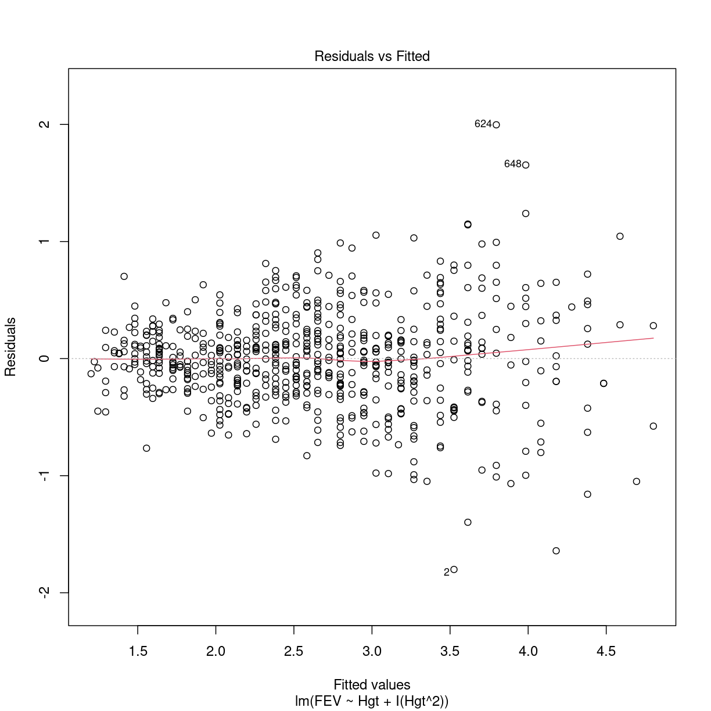
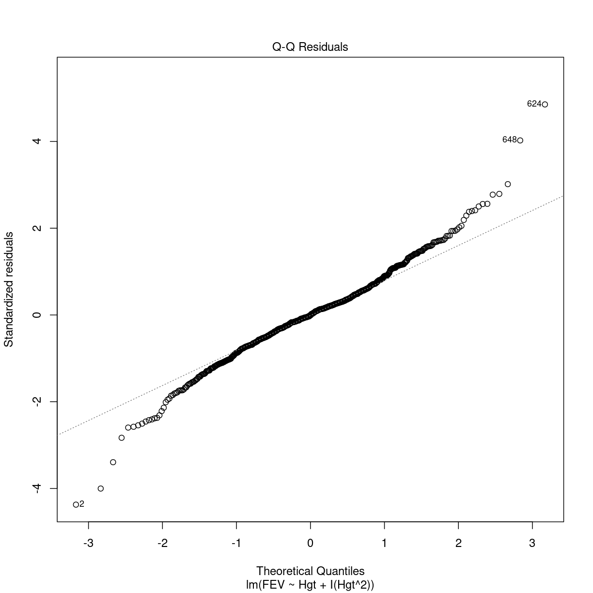
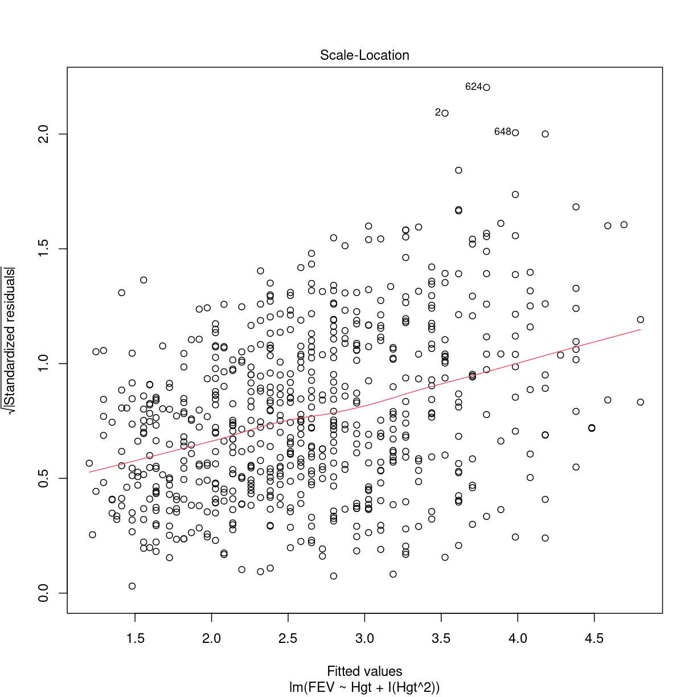
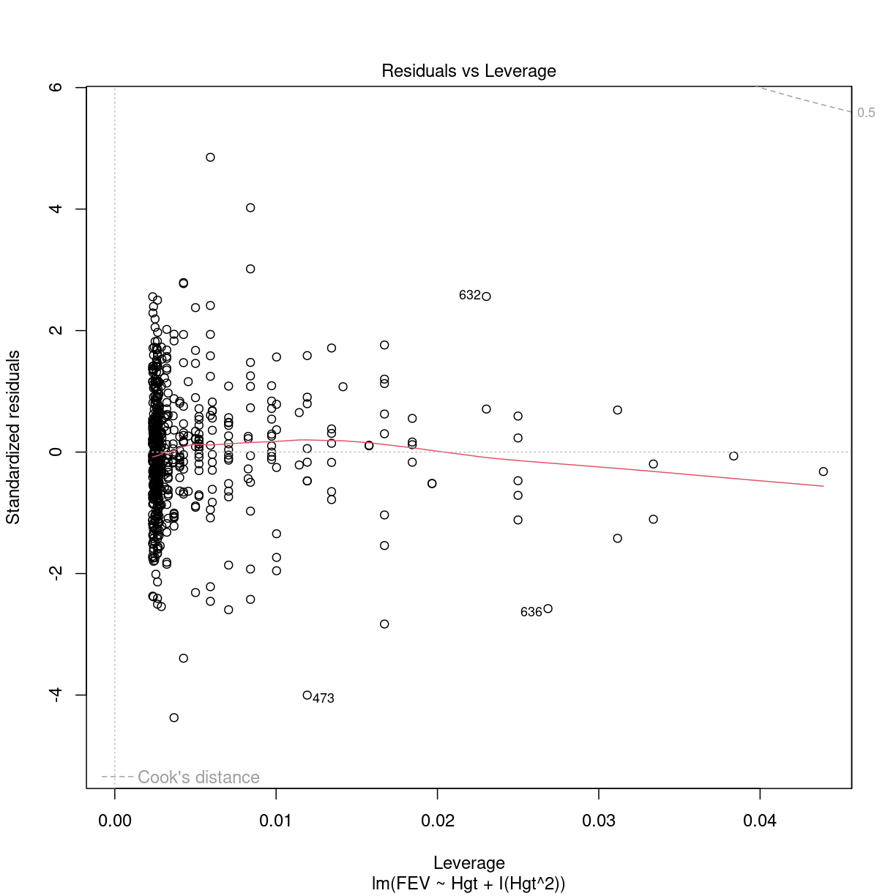

---
# Please do not edit this file directly; it is auto generated.
# Instead, please edit 05-multiple-modeller.md in _episodes_rmd/
title: "Multipel lineær regression - og polynomisk"
teaching: 10
exercises: 5
questions:
- "Hvordan fitter jeg lineære modeller af mere end en parameter?"
- "Hvordan fitter jeg polynomiske modeller?"
objectives:
- "FIXME"
keypoints:
- "FIXME"
source: Rmd
math: yes
---

# NB R-eksempler til modul 3 - ikke færdig!

Vi arbejder videre med fev datasættet. Først indlæser vi biblioteker:

~~~
library(tidyverse)
~~~
{: .language-r}

Og så indlæser vi datasættet:

~~~
Rows: 654 Columns: 6
── Column specification ────────────────────────────────────────────────────────
Delimiter: ","
dbl (6): Id, Age, FEV, Hgt, Sex, Smoke

ℹ Use `spec()` to retrieve the full column specification for this data.
ℹ Specify the column types or set `show_col_types = FALSE` to quiet this message.
~~~
{: .output}

~~~
fev <- read_csv("data/FEV.csv")
~~~
{: .language-r}

Vi kommer i øvelser til at arbejde med BONEDEN datasættet. Det læser vi også ind:

~~~
Rows: 41 Columns: 25
── Column specification ────────────────────────────────────────────────────────
Delimiter: ","
dbl (25): ID, age, zyg, ht1, wt1, tea1, cof1, alc1, cur1, men1, pyr1, ls1, f...

ℹ Use `spec()` to retrieve the full column specification for this data.
ℹ Specify the column types or set `show_col_types = FALSE` to quiet this message.
~~~
{: .output}

~~~
boneden <- read_csv("data/BONEDEN.csv")
~~~
{: .language-r}

## Multipel lineær regression

Hvordan gør vi?

~~~
model1 <- lm(FEV ~Age +Hgt, data = fev)
~~~
{: .language-r}

Hvad hvis vi vil have en kategorisk variabel i modellen?

~~~
model2 <- lm(FEV ~Age + Hgt + factor(Sex), data = fev)
~~~
{: .language-r}

Hvis R skal kunne håndtere kategoriske variable korrekt, er vi nødt til at 
fortælle R at det er en kategorisk variabel. Det gør vi ved at pakke
variablen ind i `factor()`. 

Og hvis vi vil have to kategoriske variable i modellen?

~~~
model3 <- lm(FEV ~ Age + Hgt + factor(Sex) + factor(Smoke), data = fev)
~~~
{: .language-r}

Nu skal I selv! Vi starter med model1:

> ## Forudsigelse fra model 1
> 
> Forudsig det bedste bud på FEV for en 10-årig, der er 150 cm
> høj.
>
> Husk - data er i tommer, så divider højden med 2.54.
>
> > ## Løsningsforslag
> > 
> > Model1 fortæller os hvad koefficienterne er:
> > 
> > ~~~
> > summary(model1)
> > ~~~
> > {: .language-r}
> > 
> > 
> > 
> > ~~~
> > 
> > Call:
> > lm(formula = FEV ~ Age + Hgt, data = fev)
> > 
> > Residuals:
> >      Min       1Q   Median       3Q      Max 
> > -1.50533 -0.25657 -0.01184  0.24575  2.01914 
> > 
> > Coefficients:
> >              Estimate Std. Error t value Pr(>|t|)    
> > (Intercept) -4.610466   0.224271 -20.558  < 2e-16 ***
> > Age          0.054281   0.009106   5.961 4.11e-09 ***
> > Hgt          0.109712   0.004716  23.263  < 2e-16 ***
> > ---
> > Signif. codes:  0 '***' 0.001 '**' 0.01 '*' 0.05 '.' 0.1 ' ' 1
> > 
> > Residual standard error: 0.4197 on 651 degrees of freedom
> > Multiple R-squared:  0.7664,	Adjusted R-squared:  0.7657 
> > F-statistic:  1068 on 2 and 651 DF,  p-value: < 2.2e-16
> > ~~~
> > {: .output}
> > 
> > Det giver denne model:
> >
> > FEV = -4.610466 + 0.054281*Age +  0.109712*Hgt
> > 
> > Højden beregner vi som 150/2.54 = 59.05512 i tommer.
> > 
> > Indsæt værdierne:
> > 
> > FEV = -4.610466 + 0.054281*10 +  0.109712*59.05512
> > 
> > eller: 2.411399
> >
> > Alternativ løsning:
> > 
> > 
> > ~~~
> > nye_data <- data.frame(Age = 10, Hgt = 59.05512)
> > 
> > predict(model1, newdata = nye_data)
> > ~~~
> > {: .language-r}
> > 
> > 
> > 
> > ~~~
> >        1 
> > 2.411386 
> > ~~~
> > {: .output}
> >
> {: .solution}
{: .challenge}

> ## Hvilket interval "stoler" vi på?
>
> I hvilket interval er vi 95% "sikre" på at FEV vil ligge for en
> 10-årig, 150 cm høj person?
>
> Hint: Konfidensintervaller
> 
> > ## Løsningsforslag
> > 
> > Vi skal bruge konfidensintervallerne på vores parametre:
> >
> > 
> > ~~~
> > confint(model1)
> > ~~~
> > {: .language-r}
> > 
> > 
> > 
> > ~~~
> >                   2.5 %      97.5 %
> > (Intercept) -5.05084726 -4.17008507
> > Age          0.03639976  0.07216159
> > Hgt          0.10045104  0.11897263
> > ~~~
> > {: .output}
> > 
> > 
> > Alternativ løsning:
> > 
> > 
> > ~~~
> > nye_data <- data.frame(Age = 10, Hgt = 59.05512)
> > predict(model1, newdata = nye_data, interval = "predict")
> > ~~~
> > {: .language-r}
> > 
> > 
> > 
> > ~~~
> >        fit      lwr      upr
> > 1 2.411386 1.586368 3.236405
> > ~~~
> > {: .output}
> > 
> {: .solution}
{: .challenge}

Og hvordan beregner vi konfidensintervallet i hånden?

> ## Giver det mening?
> 
> Hvad er vores bedste bud på FEV for en 0-årig, 150 cm høj person?
>
> Giver det mening?
> 
> > ## Løsningsforslag
> >
> > FEV = -4.610466 + 0.054281*0 +  0.109712*59.05512
> > 
> > eller: 1.868589
> > 
> > Nej. Vores model giver ikke nødvendigvis mening når vi bevæger os
> > udenfor de interval hvor vi har lavet vores model.
> > 
> {: .solution}
{: .challenge}

Og så fortsætter vi med model 2:

> ## Forudsigelse fra model 2
> 
> Hvad er modellens bedste bud på FEV for en 10-årig pige, der er 
> 150 cm høj?
>
> Hvad er modellens bedste bud på FEV for en 10-årig dreng, der
> er 150 cm høj?
>
> Hvad er forskellen? Siger modellen at den skal være der?
>
> > ## Løsningsforslag
> > 
> > 
> {: .solution}
{: .challenge}

> ## Hvilket interval "stoler" vi på?
>
> I hvilket interval er vi 95% "sikre" på at FEV er for denne
> pige?
> 
> 
> 
> > ## Løsningsforslag
> >
> >
> {: .solution}
{: .challenge}

Og til slut øvelser til model 3:

øvleser model 3

## Polynomiske modeller

Vi kommer til at lave en polynomisk model af FEV mod Hgt:

~~~
plot(fev$Hgt, fev$FEV)
~~~
{: .language-r}

plot of chunk unnamed-chunk-14

Det kunne godt se ud som om FEV stiger lidt mere end bare lineært med højden.

Lineært fungerer OK:

~~~
linear_model <- lm(FEV ~ Hgt, data = fev)
summary(linear_model)
~~~
{: .language-r}

~~~

Call:
lm(formula = FEV ~ Hgt, data = fev)

Residuals:
     Min       1Q   Median       3Q      Max 
-1.75167 -0.26619 -0.00401  0.24474  2.11936 

Coefficients:
             Estimate Std. Error t value Pr(>|t|)    
(Intercept) -5.432679   0.181460  -29.94   <2e-16 ***
Hgt          0.131976   0.002955   44.66   <2e-16 ***
---
Signif. codes:  0 '***' 0.001 '**' 0.01 '*' 0.05 '.' 0.1 ' ' 1

Residual standard error: 0.4307 on 652 degrees of freedom
Multiple R-squared:  0.7537,	Adjusted R-squared:  0.7533 
F-statistic:  1995 on 1 and 652 DF,  p-value: < 2.2e-16
~~~
{: .output}

Vi laver en polynomisk model:

~~~
tredieordens_model <- lm(FEV ~ Hgt + I(Hgt^2) + I(Hgt^3), data = fev)
summary(tredieordens_model)
~~~
{: .language-r}

~~~

Call:
lm(formula = FEV ~ Hgt + I(Hgt^2) + I(Hgt^3), data = fev)

Residuals:
     Min       1Q   Median       3Q      Max 
-1.79617 -0.22999  0.00229  0.21702  1.99786 

Coefficients:
              Estimate Std. Error t value Pr(>|t|)
(Intercept)  4.569e-01  1.268e+01   0.036    0.971
Hgt          3.060e-02  6.361e-01   0.048    0.962
I(Hgt^2)    -1.522e-03  1.058e-02  -0.144    0.886
I(Hgt^3)     2.580e-05  5.829e-05   0.443    0.658

Residual standard error: 0.413 on 650 degrees of freedom
Multiple R-squared:  0.7742,	Adjusted R-squared:  0.7731 
F-statistic: 742.7 on 3 and 650 DF,  p-value: < 2.2e-16
~~~
{: .output}
Det var _ikke_ imponerende...

> ## I() funktionen
> 
> Hvis ikke vi pakker x^2 ind i en I() funktion, vil R forsøge at fortolke hvad
> x^2 betyder. R vil prøve at fortolke ^2 som et interaktionsled. Og det kan 
> føre til underlige resultater.
> 
> I() funktionen undertrykker Rs fortolkning af ting, og sender x^2 videre til
> lm() funktionen, "as is", som det er, uden at R prøver at gøre ting ved det.
> 
{: .callout}

Går det bedre med et andengradspolynomium?

~~~
andenordens_model <- lm(FEV ~ Hgt + I(Hgt^2), data = fev)
summary(andenordens_model)
~~~
{: .language-r}

~~~

Call:
lm(formula = FEV ~ Hgt + I(Hgt^2), data = fev)

Residuals:
     Min       1Q   Median       3Q      Max 
-1.80103 -0.22928 -0.00255  0.21924  1.99699 

Coefficients:
              Estimate Std. Error t value Pr(>|t|)    
(Intercept)  6.0268779  1.5031843   4.009 6.79e-05 ***
Hgt         -0.2500488  0.0498553  -5.015 6.83e-07 ***
I(Hgt^2)     0.0031553  0.0004111   7.675 6.07e-14 ***
---
Signif. codes:  0 '***' 0.001 '**' 0.01 '*' 0.05 '.' 0.1 ' ' 1

Residual standard error: 0.4127 on 651 degrees of freedom
Multiple R-squared:  0.7741,	Adjusted R-squared:  0.7734 
F-statistic:  1115 on 2 and 651 DF,  p-value: < 2.2e-16
~~~
{: .output}

_Meget_ bedre!

En forudsætning for modellen er at residualerne er normalfordelte.
Det kan vi teste ved at lave et QQ-plot:

~~~
plot(andenordens_model) 
~~~
{: .language-r}

plot of chunk unnamed-chunk-18

plot of chunk unnamed-chunk-18

plot of chunk unnamed-chunk-18

plot of chunk unnamed-chunk-18

### Lad os sammenligne modellerne

Vi laver et scatter plot af vores data, og de tre modeller:

~~~
fev %>% ggplot(aes(x = Hgt, y = FEV)) +
  geom_point() +
  geom_smooth(method = "lm", colour = "green", se = FALSE) +
  geom_smooth(method = "lm", formula = y ~ poly(x, 2), colour = "blue", se = FALSE) +
  geom_smooth(method = "lm", formula = y ~ poly(x, 3), colour = "red", se = FALSE)
~~~
{: .language-r}

~~~
`geom_smooth()` using formula = 'y ~ x'
~~~
{: .output}

plot of chunk unnamed-chunk-19

Vi kan her gøre det enkelt, har vi mere komplekse modeller, er vi nødt til at 
lave forudsigelser for forskelligt input, og plotte resultaterne.

Prøv nu selv med boneden datasættet.


