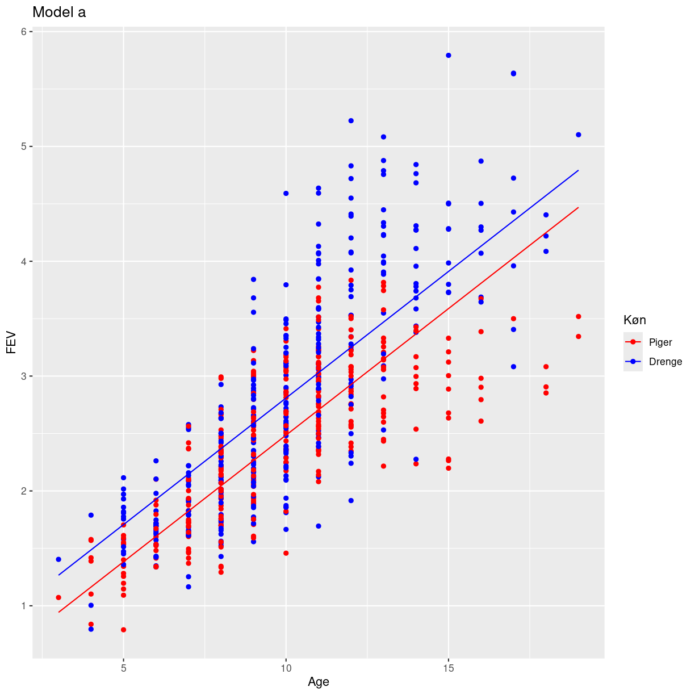
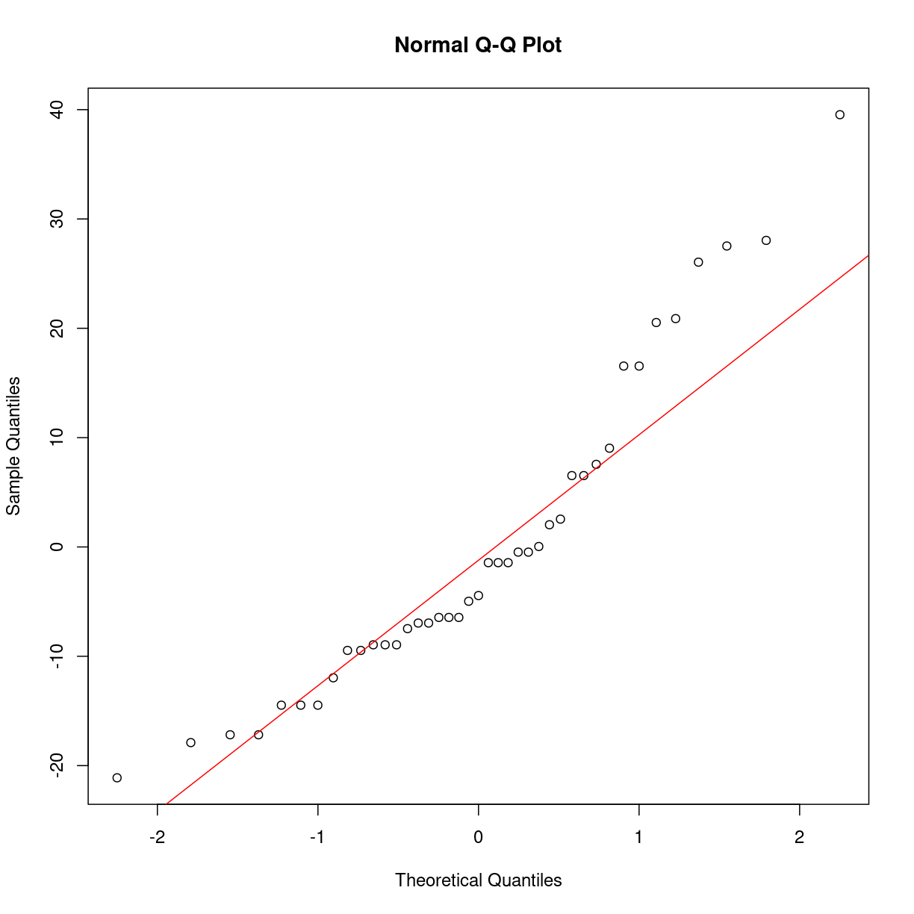

---
# Please do not edit this file directly; it is auto generated.
# Instead, please edit 05-multiple-modeller.md in _episodes_rmd/
title: "Multipel lineær regression - og polynomisk"
teaching: 10
exercises: 5
questions:
- "Hvordan fitter jeg lineære modeller af mere end en parameter?"
- "Hvordan fitter jeg polynomiske modeller?"
objectives:
- "FIXME"
keypoints:
- "FIXME"
source: Rmd
math: yes
---

# R-eksempler til modul 3

Vi arbejder videre med fev datasættet. Først indlæser vi biblioteker:

~~~
library(tidyverse)
~~~
{: .language-r}

Og så indlæser vi datasættet:

~~~
fev <- read_csv("data/FEV.csv")
~~~
{: .language-r}

~~~
Rows: 654 Columns: 6
── Column specification ────────────────────────────────────────────────────────
Delimiter: ","
dbl (6): Id, Age, FEV, Hgt, Sex, Smoke

ℹ Use `spec()` to retrieve the full column specification for this data.
ℹ Specify the column types or set `show_col_types = FALSE` to quiet this message.
~~~
{: .output}

Vi kommer i øvelser til at arbejde med BONEDEN datasættet. Det læser vi også ind:

~~~
boneden <- read_csv("data/BONEDEN.csv")
~~~
{: .language-r}

~~~
Rows: 41 Columns: 25
── Column specification ────────────────────────────────────────────────────────
Delimiter: ","
dbl (25): ID, age, zyg, ht1, wt1, tea1, cof1, alc1, cur1, men1, pyr1, ls1, f...

ℹ Use `spec()` to retrieve the full column specification for this data.
ℹ Specify the column types or set `show_col_types = FALSE` to quiet this message.
~~~
{: .output}

## Multipel lineær regression

Hvordan gør vi?

~~~
model1 <- lm(FEV ~Age +Hgt, data = fev)
summary(model1)
~~~
{: .language-r}

~~~

Call:
lm(formula = FEV ~ Age + Hgt, data = fev)

Residuals:
     Min       1Q   Median       3Q      Max 
-1.50533 -0.25657 -0.01184  0.24575  2.01914 

Coefficients:
             Estimate Std. Error t value Pr(>|t|)    
(Intercept) -4.610466   0.224271 -20.558  < 2e-16 ***
Age          0.054281   0.009106   5.961 4.11e-09 ***
Hgt          0.109712   0.004716  23.263  < 2e-16 ***
---
Signif. codes:  0 '***' 0.001 '**' 0.01 '*' 0.05 '.' 0.1 ' ' 1

Residual standard error: 0.4197 on 651 degrees of freedom
Multiple R-squared:  0.7664,	Adjusted R-squared:  0.7657 
F-statistic:  1068 on 2 and 651 DF,  p-value: < 2.2e-16
~~~
{: .output}

Hvad hvis vi vil have en kategorisk variabel i modellen?

~~~
model2 <- lm(FEV ~Age + Hgt + factor(Sex), data = fev)
summary(model2)
~~~
{: .language-r}

~~~

Call:
lm(formula = FEV ~ Age + Hgt + factor(Sex), data = fev)

Residuals:
     Min       1Q   Median       3Q      Max 
-1.37613 -0.24834  0.01051  0.25748  1.94538 

Coefficients:
              Estimate Std. Error t value Pr(>|t|)    
(Intercept)  -4.448560   0.222966 -19.952  < 2e-16 ***
Age           0.061364   0.009069   6.766 2.96e-11 ***
Hgt           0.104560   0.004756  21.986  < 2e-16 ***
factor(Sex)1  0.161112   0.033125   4.864 1.45e-06 ***
---
Signif. codes:  0 '***' 0.001 '**' 0.01 '*' 0.05 '.' 0.1 ' ' 1

Residual standard error: 0.4126 on 650 degrees of freedom
Multiple R-squared:  0.7746,	Adjusted R-squared:  0.7736 
F-statistic: 744.6 on 3 and 650 DF,  p-value: < 2.2e-16
~~~
{: .output}

Hvis R skal kunne håndtere kategoriske variable korrekt, er vi nødt til at 
fortælle R at det er en kategorisk variabel. Det gør vi ved at pakke
variablen ind i `factor()`. 

Og hvis vi vil have to kategoriske variable i modellen?

~~~
model3 <- lm(FEV ~ Age + Hgt + factor(Sex) + factor(Smoke), data = fev)
summary(model3)
~~~
{: .language-r}

~~~

Call:
lm(formula = FEV ~ Age + Hgt + factor(Sex) + factor(Smoke), data = fev)

Residuals:
     Min       1Q   Median       3Q      Max 
-1.37656 -0.25033  0.00894  0.25588  1.92047 

Coefficients:
                Estimate Std. Error t value Pr(>|t|)    
(Intercept)    -4.456974   0.222839 -20.001  < 2e-16 ***
Age             0.065509   0.009489   6.904 1.21e-11 ***
Hgt             0.104199   0.004758  21.901  < 2e-16 ***
factor(Sex)1    0.157103   0.033207   4.731 2.74e-06 ***
factor(Smoke)1 -0.087246   0.059254  -1.472    0.141    
---
Signif. codes:  0 '***' 0.001 '**' 0.01 '*' 0.05 '.' 0.1 ' ' 1

Residual standard error: 0.4122 on 649 degrees of freedom
Multiple R-squared:  0.7754,	Adjusted R-squared:  0.774 
F-statistic:   560 on 4 and 649 DF,  p-value: < 2.2e-16
~~~
{: .output}
### Husk også den deskreptive statistik!

Hvor mange observationer har vi blandt de kategoriske variable:

~~~
table(smoke = fev$Smoke, sex = fev$Sex)
~~~
{: .language-r}

~~~
     sex
smoke   0   1
    0 279 310
    1  39  26
~~~
{: .output}

Nu skal I selv! Vi starter med model1:

> ## Forudsigelse fra model 1
> 
> Forudsig det bedste bud på FEV for en 10-årig, der er 150 cm
> høj.
>
> Husk - data er i tommer, så divider højden med 2.54.
>
> > ## Løsningsforslag
> > 
> > Model1 fortæller os hvad koefficienterne er:
> > 
> > ~~~
> > summary(model1)
> > ~~~
> > {: .language-r}
> > 
> > 
> > 
> > ~~~
> > 
> > Call:
> > lm(formula = FEV ~ Age + Hgt, data = fev)
> > 
> > Residuals:
> >      Min       1Q   Median       3Q      Max 
> > -1.50533 -0.25657 -0.01184  0.24575  2.01914 
> > 
> > Coefficients:
> >              Estimate Std. Error t value Pr(>|t|)    
> > (Intercept) -4.610466   0.224271 -20.558  < 2e-16 ***
> > Age          0.054281   0.009106   5.961 4.11e-09 ***
> > Hgt          0.109712   0.004716  23.263  < 2e-16 ***
> > ---
> > Signif. codes:  0 '***' 0.001 '**' 0.01 '*' 0.05 '.' 0.1 ' ' 1
> > 
> > Residual standard error: 0.4197 on 651 degrees of freedom
> > Multiple R-squared:  0.7664,	Adjusted R-squared:  0.7657 
> > F-statistic:  1068 on 2 and 651 DF,  p-value: < 2.2e-16
> > ~~~
> > {: .output}
> > 
> > Det giver denne model:
> >
> > FEV = -4.610466 + 0.054281*Age +  0.109712*Hgt
> > 
> > Højden beregner vi som 150/2.54 = 59.05512 i tommer.
> > 
> > Indsæt værdierne:
> > 
> > FEV = -4.610466 + 0.054281*10 +  0.109712*59.05512
> > 
> > eller: 2.411399
> >
> > Alternativ løsning:
> > 
> > 
> > ~~~
> > nye_data <- data.frame(Age = 10, Hgt = 59.05512)
> > 
> > predict(model1, newdata = nye_data)
> > ~~~
> > {: .language-r}
> > 
> > 
> > 
> > ~~~
> >        1 
> > 2.411386 
> > ~~~
> > {: .output}
> >
> > Denne fremgangsmåde er særligt nyttig når vi skal lave flere
> > forudsigelser.
> > 
> {: .solution}
{: .challenge}

> ## Hvilket interval "stoler" vi på?
>
> I hvilket interval er vi “95% sikre” på, at FEV vil være for en 10-årig 
> 150 cm høj person? 
> Hint: prædiktionsintervaller.
> 
> > ## Løsningsforslag
> > 
> > 
> > 
> > ~~~
> > nye_data <- data.frame(Age = 10, Hgt = 59.05512)
> > predict(model1, newdata = nye_data, interval = "predict")
> > ~~~
> > {: .language-r}
> > 
> > 
> > 
> > ~~~
> >        fit      lwr      upr
> > 1 2.411386 1.586368 3.236405
> > ~~~
> > {: .output}
> > 
> {: .solution}
{: .challenge}

> ## Giver det mening?
> 
> Hvad er vores bedste bud på FEV for en 0-årig, 150 cm høj person?
>
> Giver det mening?
> 
> > ## Løsningsforslag
> >
> > FEV = -4.610466 + 0.054281*0 +  0.109712*59.05512
> > 
> > eller: 1.868589
> > 
> > Nej. Vores model giver ikke nødvendigvis mening når vi bevæger os
> > udenfor det interval hvor vi har lavet vores model.
> >
> > Alternativ til beregning i hånden:
> > 
> > 
> > ~~~
> > nye_data <- data.frame(Age = 0, Hgt = 150/2.54)
> > predict(model1, newdata = nye_data)
> > ~~~
> > {: .language-r}
> > 
> > 
> > 
> > ~~~
> >        1 
> > 1.868579 
> > ~~~
> > {: .output}
> >
> {: .solution}
{: .challenge}

Og så fortsætter vi med model 2:

> ## Forudsigelse fra model 2 - piger
> 
> Hvad er modellens bedste bud på FEV for en 10-årig pige, der er 
> 150 cm høj?
>
> Husk, piger er kodet som "0", drenge som "1" i datasættet.
> 
>
> > ## Løsningsforslag
> > 
> > 
> > ~~~
> > summary(model2)
> > ~~~
> > {: .language-r}
> > 
> > 
> > 
> > ~~~
> > 
> > Call:
> > lm(formula = FEV ~ Age + Hgt + factor(Sex), data = fev)
> > 
> > Residuals:
> >      Min       1Q   Median       3Q      Max 
> > -1.37613 -0.24834  0.01051  0.25748  1.94538 
> > 
> > Coefficients:
> >               Estimate Std. Error t value Pr(>|t|)    
> > (Intercept)  -4.448560   0.222966 -19.952  < 2e-16 ***
> > Age           0.061364   0.009069   6.766 2.96e-11 ***
> > Hgt           0.104560   0.004756  21.986  < 2e-16 ***
> > factor(Sex)1  0.161112   0.033125   4.864 1.45e-06 ***
> > ---
> > Signif. codes:  0 '***' 0.001 '**' 0.01 '*' 0.05 '.' 0.1 ' ' 1
> > 
> > Residual standard error: 0.4126 on 650 degrees of freedom
> > Multiple R-squared:  0.7746,	Adjusted R-squared:  0.7736 
> > F-statistic: 744.6 on 3 and 650 DF,  p-value: < 2.2e-16
> > ~~~
> > {: .output}
> > 
> > Her har vi koeeficienterne, og vi kan regne det ud i hånden:
> >
> > 
> > ~~~
> > -4.448560 + 10 * 0.061364 + 150/2.54 * 0.104560 + 0 * 0.161112
> > ~~~
> > {: .language-r}
> > 
> > 
> > 
> > ~~~
> > [1] 2.339883
> > ~~~
> > {: .output}
> > 
> > Eller, med predict funtionen:
> >
> > 
> > ~~~
> > nye_data <- data.frame(Age = 10, Hgt = 150/2.54, Sex = factor(0))
> > predict(model2, newdata = nye_data)
> > ~~~
> > {: .language-r}
> > 
> > 
> > 
> > ~~~
> >       1 
> > 2.33986 
> > ~~~
> > {: .output}
> > 
> {: .solution}
{: .challenge}

> ## Hvilket interval "stoler" vi på?
>
> I hvilket interval er vi “95% sikre” på, at FEV vil være for denne pige? 
> 
> Husk, piger er kodet som "0", drenge som "1" i datasættet.
> 
> > ## Løsningsforslag
> >
> > 
> > ~~~
> > nye_data <- data.frame(Age = 10, Hgt = 150/2.54, Sex = factor(0))
> > predict(model2, newdata = nye_data, interval = "prediction")
> > ~~~
> > {: .language-r}
> > 
> > 
> > 
> > ~~~
> >       fit      lwr      upr
> > 1 2.33986 1.528318 3.151403
> > ~~~
> > {: .output}
> >
> {: .solution}
{: .challenge}

> ## Forudsigelse fra model 2 - hvad med drengene?
> 
> Hvad er modellens bedste bud på FEV for en 10-årig dreng, der er 
> 150 cm høj?
>
> Sammenlign med forudsigelsen for en tilsvarende pige - giver forskellen 
> mening?
>
> Husk, piger er kodet som "0", drenge som "1" i datasættet.
> 
>
> > ## Løsningsforslag
> > 
> > 
> > ~~~
> > summary(model2)
> > ~~~
> > {: .language-r}
> > 
> > 
> > 
> > ~~~
> > 
> > Call:
> > lm(formula = FEV ~ Age + Hgt + factor(Sex), data = fev)
> > 
> > Residuals:
> >      Min       1Q   Median       3Q      Max 
> > -1.37613 -0.24834  0.01051  0.25748  1.94538 
> > 
> > Coefficients:
> >               Estimate Std. Error t value Pr(>|t|)    
> > (Intercept)  -4.448560   0.222966 -19.952  < 2e-16 ***
> > Age           0.061364   0.009069   6.766 2.96e-11 ***
> > Hgt           0.104560   0.004756  21.986  < 2e-16 ***
> > factor(Sex)1  0.161112   0.033125   4.864 1.45e-06 ***
> > ---
> > Signif. codes:  0 '***' 0.001 '**' 0.01 '*' 0.05 '.' 0.1 ' ' 1
> > 
> > Residual standard error: 0.4126 on 650 degrees of freedom
> > Multiple R-squared:  0.7746,	Adjusted R-squared:  0.7736 
> > F-statistic: 744.6 on 3 and 650 DF,  p-value: < 2.2e-16
> > ~~~
> > {: .output}
> > 
> > Her har vi koeeficienterne, og vi kan regne det ud i hånden:
> >
> > 
> > ~~~
> > -4.448560 + 10 * 0.061364 + 150/2.54 * 0.104560 + 1 * 0.161112
> > ~~~
> > {: .language-r}
> > 
> > 
> > 
> > ~~~
> > [1] 2.500995
> > ~~~
> > {: .output}
> > 
> > Eller, med predict funtionen:
> >
> > 
> > ~~~
> > nye_data <- data.frame(Age = 10, Hgt = 150/2.54, Sex = factor(1))
> > predict(model2, newdata = nye_data)
> > ~~~
> > {: .language-r}
> > 
> > 
> > 
> > ~~~
> >        1 
> > 2.500972 
> > ~~~
> > {: .output}
> > 
> > Om forskellen giver mening? Både og. Modellen forudsiger at drenges
> > lungevolumen er 0.16 liter større end pigers. Så forudsigelsen skal
> > være højere. Det giver dog ikke nødvendigvis fysiologisk mening at 
> > der skulle være forskel på præpubertære børn. Måske indfyldelsen skyldes
> > at vi har betydeligt ældre børn i datasættet også?
> > 
> {: .solution}
{: .challenge}

Og til slut øvelser til model 3:

> ## Forudsigelser baseret på model 3
> 
> Forudsig bedste bud på FEV for en 10-årig pige med højde 150 cm, 
> som desuden ryger.
>
> > ## Løsningsforslag
> >
> > 
> > ~~~
> > summary(model3)
> > ~~~
> > {: .language-r}
> > 
> > 
> > 
> > ~~~
> > 
> > Call:
> > lm(formula = FEV ~ Age + Hgt + factor(Sex) + factor(Smoke), data = fev)
> > 
> > Residuals:
> >      Min       1Q   Median       3Q      Max 
> > -1.37656 -0.25033  0.00894  0.25588  1.92047 
> > 
> > Coefficients:
> >                 Estimate Std. Error t value Pr(>|t|)    
> > (Intercept)    -4.456974   0.222839 -20.001  < 2e-16 ***
> > Age             0.065509   0.009489   6.904 1.21e-11 ***
> > Hgt             0.104199   0.004758  21.901  < 2e-16 ***
> > factor(Sex)1    0.157103   0.033207   4.731 2.74e-06 ***
> > factor(Smoke)1 -0.087246   0.059254  -1.472    0.141    
> > ---
> > Signif. codes:  0 '***' 0.001 '**' 0.01 '*' 0.05 '.' 0.1 ' ' 1
> > 
> > Residual standard error: 0.4122 on 649 degrees of freedom
> > Multiple R-squared:  0.7754,	Adjusted R-squared:  0.774 
> > F-statistic:   560 on 4 and 649 DF,  p-value: < 2.2e-16
> > ~~~
> > {: .output}
> > 
> > Her har vi koeeficienterne, og vi kan regne det ud i hånden:
> >
> > 
> > ~~~
> > -4.456974 + 10 * 0.065509 + 150/2.54 * 0.104199 + 0 * 0.157103 + 1 * (-0.087246)
> > ~~~
> > {: .language-r}
> > 
> > 
> > 
> > ~~~
> > [1] 2.264354
> > ~~~
> > {: .output}
> > 
> > Eller, med predict funtionen:
> >
> > 
> > ~~~
> > nye_data <- data.frame(Age = 10, Hgt = 150/2.54, Sex = factor(0), Smoke = factor(1))
> > predict(model3, newdata = nye_data)
> > ~~~
> > {: .language-r}
> > 
> > 
> > 
> > ~~~
> >        1 
> > 2.264382 
> > ~~~
> > {: .output}
> {: .solution}
{: .challenge}

> ## Hvilket interval "stoler" vi på?
> 
> I hvilket interval er vi “95% sikre” på, at FEV vil være for denne pige? 
>
> > ## Løsningsforslag
> > 
> > 
> > ~~~
> > nye_data <- data.frame(Age = 10, Hgt = 150/2.54, Sex = factor(0), Smoke = factor(1))
> > predict(model3, newdata = nye_data, interval = "prediction")
> > ~~~
> > {: .language-r}
> > 
> > 
> > 
> > ~~~
> >        fit      lwr      upr
> > 1 2.264382 1.447342 3.081423
> > ~~~
> > {: .output}
> >
> {: .solution}
{: .challenge}

> ## Og for en ikke-rygende pige
> 
> Forudsig bedste bud på FEV for en 10-årig pige med højde 150 cm, som ikke ryger.
> 
> Sammenlign med resultatet for en rygende pige. Hvad er forskellen? Siger
> modellen, at denne forskel bør være der?
>
> > ## Løsningsforslag
> > 
> > ~~~
> > summary(model3)
> > ~~~
> > {: .language-r}
> > 
> > 
> > 
> > ~~~
> > 
> > Call:
> > lm(formula = FEV ~ Age + Hgt + factor(Sex) + factor(Smoke), data = fev)
> > 
> > Residuals:
> >      Min       1Q   Median       3Q      Max 
> > -1.37656 -0.25033  0.00894  0.25588  1.92047 
> > 
> > Coefficients:
> >                 Estimate Std. Error t value Pr(>|t|)    
> > (Intercept)    -4.456974   0.222839 -20.001  < 2e-16 ***
> > Age             0.065509   0.009489   6.904 1.21e-11 ***
> > Hgt             0.104199   0.004758  21.901  < 2e-16 ***
> > factor(Sex)1    0.157103   0.033207   4.731 2.74e-06 ***
> > factor(Smoke)1 -0.087246   0.059254  -1.472    0.141    
> > ---
> > Signif. codes:  0 '***' 0.001 '**' 0.01 '*' 0.05 '.' 0.1 ' ' 1
> > 
> > Residual standard error: 0.4122 on 649 degrees of freedom
> > Multiple R-squared:  0.7754,	Adjusted R-squared:  0.774 
> > F-statistic:   560 on 4 and 649 DF,  p-value: < 2.2e-16
> > ~~~
> > {: .output}
> > 
> > Her har vi koeeficienterne, og vi kan regne det ud i hånden:
> >
> > 
> > ~~~
> > -4.456974 + 10 * 0.065509 + 150/2.54 * 0.104199 + 0 * 0.157103 + 0 * (-0.087246)
> > ~~~
> > {: .language-r}
> > 
> > 
> > 
> > ~~~
> > [1] 2.3516
> > ~~~
> > {: .output}
> > 
> > Og med predict funktionen:
> > 
> > 
> > ~~~
> > nye_data <- data.frame(Age = 10, Hgt = 150/2.54, Sex = factor(0), Smoke = factor(0))
> > predict(model3, newdata = nye_data)
> > ~~~
> > {: .language-r}
> > 
> > 
> > 
> > ~~~
> >        1 
> > 2.351629 
> > ~~~
> > {: .output}
> >
> > 
> {: .solution}
{: .challenge}

## Vekselvirkning

Vi bygger to modeller, hvor FEV afhænger af alder og køn:

~~~
modela <- lm(FEV ~ Age + factor(Sex), data = fev)
summary(modela)
~~~
{: .language-r}

~~~

Call:
lm(formula = FEV ~ Age + factor(Sex), data = fev)

Residuals:
     Min       1Q   Median       3Q      Max 
-1.41495 -0.35175 -0.03717  0.31756  1.97394 

Coefficients:
             Estimate Std. Error t value Pr(>|t|)    
(Intercept)  0.281378   0.077300   3.640 0.000294 ***
Age          0.220445   0.007215  30.553  < 2e-16 ***
factor(Sex)1 0.323335   0.042609   7.588 1.13e-13 ***
---
Signif. codes:  0 '***' 0.001 '**' 0.01 '*' 0.05 '.' 0.1 ' ' 1

Residual standard error: 0.5444 on 651 degrees of freedom
Multiple R-squared:  0.607,	Adjusted R-squared:  0.6058 
F-statistic: 502.7 on 2 and 651 DF,  p-value: < 2.2e-16
~~~
{: .output}

~~~
modelb <- lm(FEV ~ Age*factor(Sex), data = fev)
summary(modelb)
~~~
{: .language-r}

~~~

Call:
lm(formula = FEV ~ Age * factor(Sex), data = fev)

Residuals:
     Min       1Q   Median       3Q      Max 
-1.64072 -0.34337 -0.04934  0.33206  1.86867 

Coefficients:
                  Estimate Std. Error t value Pr(>|t|)    
(Intercept)       0.849467   0.102199   8.312 5.51e-16 ***
Age               0.162729   0.009952  16.351  < 2e-16 ***
factor(Sex)1     -0.775867   0.142745  -5.435 7.74e-08 ***
Age:factor(Sex)1  0.110749   0.013786   8.033 4.47e-15 ***
---
Signif. codes:  0 '***' 0.001 '**' 0.01 '*' 0.05 '.' 0.1 ' ' 1

Residual standard error: 0.5196 on 650 degrees of freedom
Multiple R-squared:  0.6425,	Adjusted R-squared:  0.6408 
F-statistic: 389.4 on 3 and 650 DF,  p-value: < 2.2e-16
~~~
{: .output}
Skal vi plotte dem - er vi nødt til at beregne de forudsagte værdier for
forskellige aldre og køn.

Vi starter med at finde mulige værdier for alder og køn

~~~
cAge <- unique(fev$Age)
sexes <- levels(factor(fev$Sex))
~~~
{: .language-r}

Så laver vi alle kombinationer af de to:

~~~
pred_data <- crossing(Age = cAge, Sex = sexes)
head(pred_data)
~~~
{: .language-r}

~~~
# A tibble: 6 × 2
    Age Sex  
  <dbl> <chr>
1     3 0    
2     3 1    
3     4 0    
4     4 1    
5     5 0    
6     5 1    
~~~
{: .output}

Så tilføjer vi to kolonner, med forudsigelserne baseret på vores to modeller:

~~~
pred_data <- pred_data %>% 
  mutate(modela = predict(modela, newdata = .)) %>% 
  mutate(modelb = predict(modelb, newdata = .))
~~~
{: .language-r}

Hvordan ser forudsigelserne ud for modela?

Vi plotter alle data som et scatterplot. 

Og så tilføjer vi to rette linier, baseret på vores forudsigelser. Hvis 
vi farvelægger efter "Sex", får vi to linier:

~~~
fev %>% 
  ggplot(aes(Age, FEV, color = factor(Sex))) +
  geom_point() +
  geom_line(data = pred_data, aes(Age, modela, color = Sex)) +
  scale_color_manual(values = c("red", "blue"),
                     labels = c("Piger", "Drenge"),
                     name = "Køn") +
  ggtitle("Model a")
~~~
{: .language-r}

plot of chunk unnamed-chunk-34

Og modelb - hvor vi har en vekselvirkning med:

~~~
fev %>% 
  ggplot(aes(Age, FEV, color = factor(Sex))) +
  geom_point() +
  geom_line(data = pred_data, aes(Age, modelb, color = Sex)) +
  scale_color_manual(values = c("red", "blue"),
                     labels = c("Piger", "Drenge"),
                     name = "Køn") +
  ggtitle("Model b")
~~~
{: .language-r}

plot of chunk unnamed-chunk-35

## Test af modeller

~~~
library(car)
car::Anova(model2, type = "III")
~~~
{: .language-r}

~~~
Anova Table (Type III tests)

Response: FEV
             Sum Sq  Df F value    Pr(>F)    
(Intercept)  67.763   1 398.072 < 2.2e-16 ***
Age           7.793   1  45.779 2.957e-11 ***
Hgt          82.287   1 483.394 < 2.2e-16 ***
factor(Sex)   4.027   1  23.656 1.446e-06 ***
Residuals   110.648 650                      
---
Signif. codes:  0 '***' 0.001 '**' 0.01 '*' 0.05 '.' 0.1 ' ' 1
~~~
{: .output}

~~~
anova(model1, model2)
~~~
{: .language-r}

~~~
Analysis of Variance Table

Model 1: FEV ~ Age + Hgt
Model 2: FEV ~ Age + Hgt + factor(Sex)
  Res.Df    RSS Df Sum of Sq      F    Pr(>F)    
1    651 114.67                                  
2    650 110.65  1    4.0269 23.656 1.446e-06 ***
---
Signif. codes:  0 '***' 0.001 '**' 0.01 '*' 0.05 '.' 0.1 ' ' 1
~~~
{: .output}

## Holder forudsætningerne?

qqplots af residualerne er en oplagt test. Funktionen `plot` af modellen giver
os netop det - men også tre andre plots, der er noget mere komplicerede at tolke.

Så lad os lave bare qqplottet. Vi starter med at kigge på 
kaffe_model fra sidst:

Første trin er at trække residualerne ud:

~~~
kaffe_model <- lm(cof1 ~ tea1, data = boneden)
residualer <- resid(kaffe_model)
~~~
{: .language-r}

Dernæst plotter vi:

~~~
qqnorm(residualer)
qqline(residualer, col = "red")
~~~
{: .language-r}

plot of chunk unnamed-chunk-39

Hvordan ser det ud for vores polynomiske model?

Samme metodik - bare en anden model:

~~~
residualer <- resid(modelb)
~~~
{: .language-r}

~~~
qqnorm(residualer)
qqline(residualer, col = "red")
~~~
{: .language-r}

plot of chunk unnamed-chunk-41

Eller, hvis vi gerne vil lave det i ggplot:

~~~
data.frame(residualer) %>% 
  ggplot(aes(sample = residualer)) +
  geom_qq_line() +
  geom_qq()
~~~
{: .language-r}

plot of chunk unnamed-chunk-42

## Polynomiske modeller

Vi kommer til at lave en polynomisk model af FEV mod Hgt:

~~~
plot(fev$Hgt, fev$FEV)
~~~
{: .language-r}

plot of chunk unnamed-chunk-43

Det kunne godt se ud som om FEV stiger lidt mere end bare lineært med højden.

Lineært fungerer OK:

~~~
linear_model <- lm(FEV ~ Hgt, data = fev)
summary(linear_model)
~~~
{: .language-r}

~~~

Call:
lm(formula = FEV ~ Hgt, data = fev)

Residuals:
     Min       1Q   Median       3Q      Max 
-1.75167 -0.26619 -0.00401  0.24474  2.11936 

Coefficients:
             Estimate Std. Error t value Pr(>|t|)    
(Intercept) -5.432679   0.181460  -29.94   <2e-16 ***
Hgt          0.131976   0.002955   44.66   <2e-16 ***
---
Signif. codes:  0 '***' 0.001 '**' 0.01 '*' 0.05 '.' 0.1 ' ' 1

Residual standard error: 0.4307 on 652 degrees of freedom
Multiple R-squared:  0.7537,	Adjusted R-squared:  0.7533 
F-statistic:  1995 on 1 and 652 DF,  p-value: < 2.2e-16
~~~
{: .output}

Vi prøver en polynomisk model - tredie orden, eller "kubisk":

~~~
kubisk_model <- lm(FEV ~ Hgt + I(Hgt^2) + I(Hgt^3), data = fev)
summary(kubisk_model)
~~~
{: .language-r}

~~~

Call:
lm(formula = FEV ~ Hgt + I(Hgt^2) + I(Hgt^3), data = fev)

Residuals:
     Min       1Q   Median       3Q      Max 
-1.79617 -0.22999  0.00229  0.21702  1.99786 

Coefficients:
              Estimate Std. Error t value Pr(>|t|)
(Intercept)  4.569e-01  1.268e+01   0.036    0.971
Hgt          3.060e-02  6.361e-01   0.048    0.962
I(Hgt^2)    -1.522e-03  1.058e-02  -0.144    0.886
I(Hgt^3)     2.580e-05  5.829e-05   0.443    0.658

Residual standard error: 0.413 on 650 degrees of freedom
Multiple R-squared:  0.7742,	Adjusted R-squared:  0.7731 
F-statistic: 742.7 on 3 and 650 DF,  p-value: < 2.2e-16
~~~
{: .output}
Det var _ikke_ imponerende...

> ## I() funktionen
> 
> Hvis ikke vi pakker x^2 ind i en I() funktion, vil R forsøge at fortolke hvad
> x^2 betyder. R vil prøve at fortolke ^2 som et interaktionsled. Og det kan 
> føre til underlige resultater.
> 
> I() funktionen undertrykker Rs fortolkning af ting, og sender x^2 videre til
> lm() funktionen, "as is", som det er, uden at R prøver at gøre ting ved det.
> 
{: .callout}

Går det bedre med et andengradspolynomium? 

~~~
kvadratisk_model <- lm(FEV ~ Hgt + I(Hgt^2), data = fev)
summary(kvadratisk_model)
~~~
{: .language-r}

~~~

Call:
lm(formula = FEV ~ Hgt + I(Hgt^2), data = fev)

Residuals:
     Min       1Q   Median       3Q      Max 
-1.80103 -0.22928 -0.00255  0.21924  1.99699 

Coefficients:
              Estimate Std. Error t value Pr(>|t|)    
(Intercept)  6.0268779  1.5031843   4.009 6.79e-05 ***
Hgt         -0.2500488  0.0498553  -5.015 6.83e-07 ***
I(Hgt^2)     0.0031553  0.0004111   7.675 6.07e-14 ***
---
Signif. codes:  0 '***' 0.001 '**' 0.01 '*' 0.05 '.' 0.1 ' ' 1

Residual standard error: 0.4127 on 651 degrees of freedom
Multiple R-squared:  0.7741,	Adjusted R-squared:  0.7734 
F-statistic:  1115 on 2 and 651 DF,  p-value: < 2.2e-16
~~~
{: .output}

_Meget_ bedre!

En forudsætning for modellen er at residualerne er normalfordelte.
Det kan vi teste ved at lave et QQ-plot af dem:

~~~
residualer <- resid(kvadratisk_model) 
qqnorm(residualer)
qqline(residualer, col = "red")
~~~
{: .language-r}

plot of chunk qqplot

### Lad os sammenligne modellerne

Vi laver et scatter plot af vores data, og de tre modeller:

~~~
fev %>% ggplot(aes(x = Hgt, y = FEV)) +
  geom_point() +
  geom_smooth(method = "lm", colour = "green", se = FALSE) +
  geom_smooth(method = "lm", formula = y ~ poly(x, 2), colour = "blue", se = FALSE) +
  geom_smooth(method = "lm", formula = y ~ poly(x, 3), colour = "red", se = FALSE)
~~~
{: .language-r}

~~~
`geom_smooth()` using formula = 'y ~ x'
~~~
{: .output}

plot of chunk unnamed-chunk-47

Vi kan her gøre det enkelt, har vi mere komplekse modeller, er vi nødt til at 
lave forudsigelser for forskelligt input, og plotte resultaterne.

Prøv nu selv med boneden datasættet.

Datasættet indeholder to sæt observationer - for det er et tvillingestudie.

Nøjes med at se på denne del af datasættet, hvor vi kun har den  ene 
tvilling med, og dropper ID.

~~~
boneden %>% 
  select(age:fs1) 
~~~
{: .language-r}

~~~
# A tibble: 41 × 13
     age   zyg   ht1   wt1  tea1  cof1  alc1  cur1  men1  pyr1   ls1   fn1   fs1
   <dbl> <dbl> <dbl> <dbl> <dbl> <dbl> <dbl> <dbl> <dbl> <dbl> <dbl> <dbl> <dbl>
 1    27     2   162    57    35     0     1     1     0   0    0.81  0.72  1   
 2    42     2   165    76    42     2     3     5     1   0    1.01  0.74  0.99
 3    59     2   150   114    12     0     0     0     1   0    0.75  0.63  1.05
 4    61     1   159    62    56     0     0     0     1   0    0.81  0.64  1.12
 5    47     2   159    58    28    14     0     0     0   0    0.78  0.7   1.14
 6    33     2   163    49    35     0     3     1     0   0    0.86  0.56  1.13
 7    45     1   169    78    42     0     1     1     0   0    0.95  0.83  1.16
 8    73     1   160    76    42    14    14     8     1  25    0.76  0.56  1.05
 9    43     2   162    64     7    28     8     3     0   0.5  0.83  0.65  1.07
10    43     2   165    58     7    21     6     0     1   0    1.01  0.9   1.3 
# ℹ 31 more rows
~~~
{: .output}

> ## Hvor god en model kan du bygge?
>
> Hvor god en model kan du bygge på dette datasæt, der forklarer "fs1", 
> knogletætheden i lårbensskaftet?
>
> > ## Løsningsforslag
> >
> > Denne model har vældig gode p-værdier
> > 
> > 
> > ~~~
> > lm(formula = fs1 ~ age+I(age^2) + fn1+ I(fn1^2) +I(fn1^3), data = boneden) %>% 
> > summary()
> > ~~~
> > {: .language-r}
> > 
> > 
> > 
> > ~~~
> > 
> > Call:
> > lm(formula = fs1 ~ age + I(age^2) + fn1 + I(fn1^2) + I(fn1^3), 
> >     data = boneden)
> > 
> > Residuals:
> >       Min        1Q    Median        3Q       Max 
> > -0.148934 -0.057466 -0.002528  0.033146  0.282620 
> > 
> > Coefficients:
> >               Estimate Std. Error t value Pr(>|t|)   
> > (Intercept) -5.166e+00  2.077e+00  -2.488  0.01776 * 
> > age          2.773e-02  1.029e-02   2.694  0.01078 * 
> > I(age^2)    -2.925e-04  1.011e-04  -2.892  0.00654 **
> > fn1          2.620e+01  9.676e+00   2.708  0.01041 * 
> > I(fn1^2)    -4.006e+01  1.491e+01  -2.686  0.01099 * 
> > I(fn1^3)     2.018e+01  7.530e+00   2.680  0.01114 * 
> > ---
> > Signif. codes:  0 '***' 0.001 '**' 0.01 '*' 0.05 '.' 0.1 ' ' 1
> > 
> > Residual standard error: 0.09117 on 35 degrees of freedom
> > Multiple R-squared:  0.5573,	Adjusted R-squared:  0.494 
> > F-statistic: 8.811 on 5 and 35 DF,  p-value: 1.738e-05
> > ~~~
> > {: .output}
> > Men er det en god model? Nej Den forklarer ikke ret meget af variationen.
> >
> > Og det er en ret kompliceret model, der overfitter vores data. 
> >
> {: .solution}
{: .challenge}


