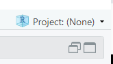

```{r setup, include=FALSE}
knitr::opts_chunk$set(echo = FALSE)
```


# Hej!

Christian Knudsen, cand.polyt. KUB Datalab

cbk@kb.dk

Vi har ikke mange forudsætninger på dette kursus.

Men der er en!

I *_skal_* have fulgt setup-vejledningen på kursushjemmesiden. R og RStudio
*_skal_* være installeret på jeres computere, eller I skal have adgang via
https://posit.cloud/

???
Det her er ikke til forhandling. Vi kommer til at bruge den første halve time
af vores i forvejen meget begrænsede tid på at få det op at køre.


---

# Dagsorden for de fem dage

1. R, RMarkdown, Hvad er statistik?, Deskriptiv statistik
2. Lineære modeller
3. Multipel lineær regression
4. Kategoriske data
5. Spørgetime

---

# Dagsorden for i dag

1. Husregler
2. Indgangsbøn
3. Reproducerbar dataanalyse
4. R og RMarkdown
5. Hvad er statistik
6. Deskriptiv statistik
7. Tabel et

---

# Husregler

<div style="display: flex; align-items: center;">

<div style="flex: 1;">
<ul>
<li>SPØRG!

<li>Eksperimenter!

<li>Hjælp hinanden!
</ul>
</div>
<div style="flex: 1;">

</div>

</div>


???
Jeg kan ikke altid se på jer når der er noget I ikke forstår.
Hvis der er noget I ikke forstår, så skal jeg forklare det bedre.
Vi kommer til at lave fejl. Vi kommer til at lave mange fejl. Og det er godt!
Der hvor vi lærer, er når vi laver fejl.
Brug hinanden som gummiænder.

---

# Gør følgende


1. Lav et projekt &#10071;
2. Hav et browservindue åbent med kursushjemmesiden &#10071;
  - hvad adressen nu bliver

--

Der er ikke meget jeg vil tvinge jer til. Men når &#10071; optræder, så
er det altså fordi I _skal_ gøre det. 

--


???
Alternativet til at I gør det er at vi over de 5 moduler skal bruge et par timer
på at resten af flokken venter på at jeg fortæller dig at du skal oprette et 
projekt.


---
# Fejlsøgning

1. Har du oprettet et projekt, og åbnet det?  

--

2. Er der forskel på "Data" og "data"?

--
  - Ja! Det er der.
  
--

3. Er der forskel på "table" og "table1"?

--
  - Ja! Det er der.

--

4. Hvis R klager over ikke at kunne finde en funktion eller et objekt så:
--
  - Kan det være du ikke har indlæst det bibliotek der leverer funktionen
--
  - Kan det være du har lavet en tastefejl
--
  - Kan det være du ikke har oprettet objektet endnu.
--

Det er utroligt hyppige fejl. Det er helt i orden at lave dem. Men prøv lige
at se om du kan finde tastefejlen inden du tilkalder hjælp.

???
Vi kommer til at begå fejl. Og dem hører jeg meget gerne om, for vi lærer
utroligt meget af at finde ud af hvad fejlen handler om, og hvordan vi retter
den. Men der er hyppigt forekommende fejl, hvor det vi skal lære er at finde
tastefejlen.

---
# Reproducerbar dataanalyse

Udfordring: Vores resultater skal kunne reproduceres.

--

Løsning: Et script!

--

I R!

--

Udfordring: Der er stadig faldgruber

--

Derfor: RMarkdown!


???
Det er fantastisk at finde en behandling der kurerer en sygdom. 
Den skal så helst virke også på den næste patient...

Scriptet er løsningen. En opskrift der fortæller computeren præcist hvad den skal
gøre for os. Hverken mere eller mindre, og præcist det samme hver gang.

Vi skal sikre os at den opskrift vi kører, er helt uafhængig af hvad vi gjorde
lige før. Lige som når vi går i køkkenet. Ovnen skal forvarmes til 200 grader.
Det gør vi ved at sætte termostaten på 200 og tænde for ovnen. Når den røde
lampe holder op med at lyse, er temperaturen nået, og vi kan sætte kagen i ovnen.

Hvis ovnen er 300 grader varm når vi starter, sætter vi termostaten til 200.
Lampen holder straks op med at lyse. Og så sætter vi vores kage ind ved 300 grader.
Vi skal have noget der sikrer at ovnen er ved samme temperatur hver gang vi 
går i gang med at bage.


---
# R og RMarkdown

Det gør vi live!


---
# Hvad er statistik

---

## Hvad gør vi?

1. Identificer det emne, du vil undersøge.
2. Indsaml data
   a. Hvis data findes i forvejen, er det jo let.
   b. Hvis data ikke findes i forvejen, skal man
      i. Overveje hvilke data der er relevante.
      ii. Lav forsøg, spørgeskemaer, mv.
3. Deskriptiv statistik for at forstå sine data.
4. Statistiske inferens for at udlede resultater 


---
# Deskriptiv statistik

- Indblik i data
- Undgå faldgruber
- Skæve fordelinger
- Outliers
- Små datasæt
- Variable, der “fortæller det samme”

---

# Eksempeldata

```{r warning=F, echo = T, eval=F}
library(tidyverse)
download.file("https://raw.githubusercontent.com/KUBDatalab/R-PUFF/main/data/HOSPITAL.csv",
              "data/HOSPITAL.csv", mode = "wb")
hospital <- read_csv("data/HOSPITAL.csv")
```

```{r warning=F, echo = F, eval=T, include=F}
library(tidyverse)
hospital <- read_csv("https://raw.githubusercontent.com/KUBDatalab/R-PUFF/main/data/HOSPITAL.csv")
```

Kopier fra kursushjemmesiden.

Og det her er: &#10071;

Længde af indlæggelse for patienter på et hospital. 
Var det medicinsk eller kirurgisk behandling, hvad var tallet for hvide blodlegemer, blev der taget bakteriekultur
på dem og fik de antibiotika. 


Længde af indlæggelse for patienter på et hospital. Var det medicinsk eller kirurgisk 
behandling, hvad var tallet for hvide blodlegemer, blev der taget bakteriekultur
på dem og fik de antibiotika. Klinisk interesse: Er der sammenhæng mellem
indlæggelsestid og antibiotikabehandling


Klinisk interesse: Er der sammenhæng mellem
indlæggelsestid og antibiotikabehandling


???
Det er en del lettere at forstå hvis vi har noget data at kigge på.

---

## Stikprøve vs. population

I almindelighed har vi stikprøver.

Helt principielt har vi faktisk kun stikprøver

---


# Start med at se på data

```{r}
head(hospital)
```

Beskrivelse af hvad hvad er.

---

# Typer af data


-  Kvantitative (kontinuerte, diskret, numerisk) data
- højde, alder, vægt, blodtryk
- Groft sagt: data der udtrykkes som sekvenser af tal
- Kvalitative (kategoriske) data
	- Ja/nej variable (gift/ugift, mand/kvinde, ryger/ikke-ryger)
	- Terningekast, socialklasse, hårfarve

???
Hvad er gennemsnittet af en rødhåret, og 2 sorthårede personer?
Det er forskellige ting vi kan gøre med forskellige typer data.


---

# Kvantitative variable - lokation

Statistiske mål der fortæller _hvor_ observationerne ligger-

*Middelværdi:*

$$\bar{x} = \frac{1}{n}\left(\sum_{i=1}^{n}x_i\right) = \frac{x_1 + x_2 + \ldots + x_n}{n}$$
Eller - summen af alle observationer, divideret med antallet af observationer.

Vi bruger $\bar{x}$ når vi taler om middelværdien af stikprøven. Og $\mu$ hvis
det er middelværdien af populationen.

*Medianen*

Den midterste værdi - alle observationer stilles op i rækkefølge efter størrelse.
Den midterste værdi er medianen. 

Den udmærker sig ved at halvdelen af observationerne er mindre end medianen.
Den anden halvdel er større. 

Medianen kan også kaldes 50%-kvantilen.


---


## I R

```{r}
mean(hospital$WBC)
```
```{r}
median(hospital$WBC)
```

Hvad kan vi udlede af at gennemsnittet er højere end medianen?

???
At tallene er skævt fordelt. Normalområdet er iøvrigt mellem 4.5 og 11.

---


# Kvantitative variable - spredning

Statistiske mål der fortæller os hvor spredte observationerne er
Spredning/standardafvigelsen (sd):

$$ \sigma =\sqrt{\frac{1}{N}\sum_{i=1}^{N}(x_1 - \mu)^2}$$
Eller - kvadratroden af summen af kvadraterne af forskellen på observationerne og 
middelværdien. Bemærk at vi her skriver $\sigma$, $\mu$ og N. Her er det altså data på 
populationen. Havde vi set på stikprøven havde vi brugt "sd", "n" og "$\bar{x}$"

Varians:

$$ \sigma^2 =\frac{1}{N}\sum_{i=1}^{N}(x_1 - \mu)^2$$


Eller - kvadratet af standardafvigelsen.  Her bruger vi også $\sigma$, $\mu$ og "N".
Det indikerer at vi taler om population. Havde vi betragtet stikprøven brugte vi 
"var", "n" og "$\bar{x}$ i stedet.

---

## I R

```{r}
sd(hospital$WBC)
```

Hvad fortæller det os?


```{r}
var(hospital$WBC)
```

???
At standardafvigelsen er så relativt stor, fortæller os at der er ret stor 
spredning omkring gennemsnittet. Måske ikke så overraskende.


---

### andre spredninger

Den mindste værdi:

```{r}
min(hospital$WBC)
```

Den største værdi:

```{r}
max(hospital$WBC)
```

Begge værdier på en gang:

```{r}
range(hospital$WBC)
```


???
Dette er mine noter til Slide 1.

---

### reference interval

Referenceinterval: de 95% midterste observationer.


Hvis data er normalfordelt, kan vi finde det med formlen:

$$ \mu \pm 1.96*\sigma$$

I R:
```{r}
mean(hospital$WBC) + c(-1,1)*1.96*sd(hospital$WBC)
```
Det passer jo tydeligvis ikke. 


???
Og det passer ikke - fordi data ikke er normalfordelte. Vi vender tilbage til
det med normalfordelingen.

---

## Visuelle metoder

Det er ofte godt at se på data. Den menneskelige hjerne er godt til at se 
mønstre, som det kan være vanskeligt at få øje på i de rene tal.

### Pas på pareidolia

Den menneskelige hjerne ser også mønstre hvor der ingen er:

[By Massimo brizzi - Own work, CC BY-SA 4.0, https://commons.wikimedia.org/w/index.php?curid=64799710](../fig/Ascaris_male_200x_section.jpg)

???
Tværsnittet af en hanlig nematode, af arten Ascaris. En rundorm.

---
### Histogrammer

```{r}
hist(hospital$WBC)
```

???
Vi tager værdierne af en variabel, deler værdierne ind i et antal "bins" og 
tæller hvor mange observationer der er i hver bin. Det ser ud til at der er 
to toppe, en nede omkring normalen, og en forhøjet. 

---

## Boxplot

Boxplots samler en masse information i et plot

```{r}
boxplot(hospital$WBC)
```
???
Den fede linie i midten er medianen. I den grå kasse har vi 50% af observationerne.
Og de to "whiskers" i hver ende er minimum og maximum

---

## Boxplot2

De bliver særligt nyttige hvis vi sammenligner to grupper:

```{r}
boxplot(WBC ~ Antibio, data = hospital)
```
???
1 er de der fik antibiotika. 2 de der ikke fik. Leukocytterne er højere blandt
de første.


## Scatterplot

Vi kan blotte to værdier mod hinanden:

```{r}
plot(hospital$Temp, hospital$WBC)
```
Her har vi temperatur på x-aksen og WBC på y-aksen. Hvad kan vi se?

???
Der er måske en svag antydning af at de med høje temperaturer har højere 
WBC. De er i Fahrenheit, og normalen er 98.6 svarende til 37 grader C. Men der 
er ikke meget feber i det her datasæt.


---


## Normalfordelingen

Hvorfor virkede det der med +/- 1.96 for referenceintervallet ikke?

Vi skrev - hvis normalfordelt.

Normalfordelingen beskriver en bestemt fordeling af data. Den er ikke specielt
normal. Men den har dejlige egenskaber.

Matematisk beskrives den som:

$$p(x) = \frac{1}{\sigma \sqrt{2\pi}} e^{-\frac{1}{2}(\frac{x-\mu}{\sigma})^2} $$ 

p er sandsynlighedstætheden. 

---

## Hvordan ser den ud?


```{r echo = F, warning=F}
library(ggplot2)

# Definer middelværdi og standardafvigelse
mu <- 0
sigma <- 1

# Opret en data frame indeholdende værdier fra normalfordelingen
x <- seq(mu - 3*sigma, mu + 3*sigma, length.out=100)
y <- dnorm(x, mean=mu, sd=sigma)
data <- data.frame(x, y)

# Plot normalfordelingen
ggplot(data, aes(x, y)) +
    geom_line(color="blue", size=1) +
    labs(title="Normal Distribution (μ=0, σ=1)", x="Value", y="Probability Density") +
    theme_minimal()

```


---
### Hvad betyder det?


```{r}
library(ggplot2)

# Definer middelværdi og standardafvigelse
mu <- 0
sigma <- 1

# Opret en data frame indeholdende værdier fra normalfordelingen
x <- seq(mu - 3*sigma, mu + 3*sigma, length.out=100)
y <- dnorm(x, mean=mu, sd=sigma)
data <- data.frame(x, y)

# Definer et punkt for annotation
annotate_x <- 1
annotate_y <- dnorm(annotate_x, mean=mu, sd=sigma)

# Plot normalfordelingen med annotation og skraveret areal
ggplot(data, aes(x, y)) +
    geom_line(color="blue", size=1) +
    geom_segment(aes(x = annotate_x, y = annotate_y, xend = annotate_x, yend = annotate_y + 0.05), 
                 arrow = arrow(length = unit(0.5, "cm")), color = "red") +
    annotate("text", x = annotate_x, y = annotate_y + 0.06, label = "dnorm", color = "red", size = 5) +
    geom_area(data = subset(data, x <= 0.25), fill="blue", alpha=0.3) +
    labs(title="Normal Distribution (μ=0, σ=1)", x="Value", y="Probability Density") +
    theme_minimal()

```
R er udstyret med fire funktioner der relaterer sig til normalfordelignen.

rnorm
pnorm
dnorm
qnorm

---


# IQR

---

# Type tal

---
## CLT

Der er ikke meget der er normalfordelt i virkeligheden. Men. Hvis vi tager en 
stikprøve af noget der er helt tilfældigt. Og beregner gennemsnittet. Og gør det
mange gange. Så vil disse gennemsnit være normalfordelte.


Hvorfor? Det kræver sandsynlighedsteori, målteori og andet godt der ligger 
langt ud over hvad vi kan komme i nærheden af.

---
# tælletal


---
# Den store tabel 1

- En mediciner ting. Det er typisk den første tabel i en artikel, hvor man præsenterer
udvalgte deskreptive statistiske mål på den stikprøve man arbejder med.
- Ingen faste krav, angiv det der giver mening for jeres studie, og for læseren.
- Lav den relativt kompakt, det er let at give læseren "information overload"

## Indhold

- For kvantitative varible, angiv typetal, middelværdi eller median for at vise 
"typisk" måling.
- Også variationsbredde, spredning eller interkvartil til at vise bredden i data
- For kvalitative variable - antallet af observationer, evt. med relative frekvenser.

---
# Chatbotten

Den har læst al dokumentationen. Så den er ikke så dum endda.

Men pas på. Den kan ikke for alvor hjælpe dig med ting du ikke selv kan. 

Du skal give den en prompt der giver et fornuftigt svar. Det kan du kun hvis
du ved hvad du spørger om.

Du skal også kunne fange uklarheder i dens svar. Det kan du kun hvis du har en
ide om ca. hvad svaret bør være. 

Når du beder den om at svare på hvad 12*12 er - så skal du helst have 
en ide om ca. hvilken størrelsesorden svaret skal være i.

Den kan hjælpe dig med at nå den hylde på reolen du lige akkurat ikke ville
kunne nå selv.


Jeg har forsøgt at få botten til at illustrere det ved at den kan hjælpe dig 
svarende til at du står på en bog, og derfor lige akkurat kan nå lidt mere.
Det er ikke helt let at få den til at acceptere at den kun hjælper svarende til
en bog...